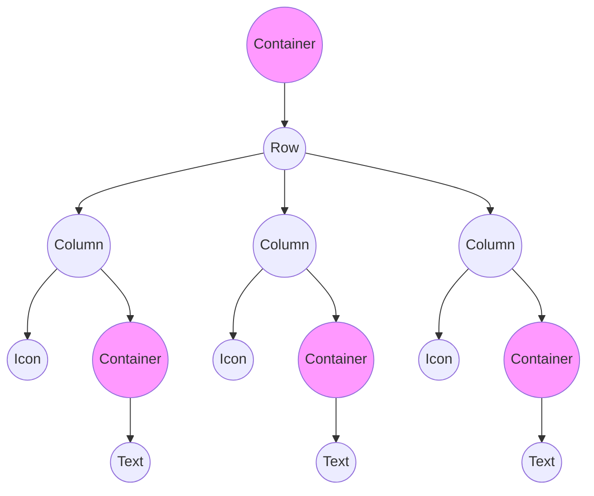

本記事は下記リンクのFlutter公式ドキュメントを学習したメモです。

[Layout in Flutter](https://docs.flutter.dev/ui/layout)

[Build a Flutter layout](https://docs.flutter.dev/ui/layout/tutorial)

開発途中のスクリーンショット以外の本記事で使用しているイメージは上記公式ドキュメントのイメージです。

# 概要

FlutterのほとんどはWidgetだ。Widgetを組み合わせてレイアウトを作る。


上のイメージを見てみよう。３つのアイコンとアイコンの下にはラベルがついている。イメージを詳細なWidgetでみると次のイメージのように構成されている。


Widgetの構造をツリーでみると次のように構成される。



Containerは子WidgetをカスタマイズできるWidgetでパディング、マージン、境界線、背景色などを追加できる。

# レイアウトを作ってみる。


*Photo by [Dino Reichmuth](https://unsplash.com/ja/%E5%86%99%E7%9C%9F/%E8%8D%89%E3%81%AB%E8%A6%86%E3%82%8F%E3%82%8C%E3%81%9F%E5%B1%B1%E3%81%AE%E8%B5%A4%E3%81%A8%E7%81%B0%E8%89%B2%E3%81%AE%E3%83%86%E3%83%B3%E3%83%88-5Rhl-kSRydQ) on [Unsplash](https://unsplash.com/ja). Text by [Switzerland Tourism](https://www.myswitzerland.com/en-us/destinations/lake-oeschinen).*

上のイメージは公式ドキュメントに載っているイメージで、イメージのレイアウトを構築してみよう。

上のイメージを大きく分けると次のような要素で分けられる。


まずはレイアウトを構築するためにFlutterプロジェクトを作成して基本的な構造を作成しておこう。

```dart
import 'package:flutter/material.dart';

void main() => runApp(const MyApp());

class MyApp extends StatelessWidget {
  const MyApp({super.key});

  @override
  Widget build(BuildContext context) {
    return MaterialApp(
      title: 'Flutter layout demo',
      home: Scaffold(
        appBar: AppBar(
          title: const Text('Flutter layout demo'),
        ),
        body: const Center(
          child: Text('Hello World!'),
        ),
      ),
    );
  }
}
```


タイトルはできた。次にイメージを入れてみよう。

まずはイメージを/assets/images/の下に入れてpubspec.yamlを修正する必要がある。

次のようになっている箇所を修正しよう。

```yaml
flutter:

  uses-material-design: true

  # To add assets to your application, add an assets section, like this:
  # assets:
  #   - images/a_dot_burr.jpeg
  #   - images/a_dot_ham.jpeg
```

下は修正後だ。

```yaml
flutter:

  uses-material-design: true

  assets:
    - assets/images/
```

上で確認した要素は縦で並んでいたのでScffoldのbodyはColumnで良さそう。

## イメージセクション

それぞれの大きな要素は繰り返し使う要素になる可能性も多いので別クラスで定義してみよう。

/libの下にwidgetsとフォルダを作成してimage_section.dartファイルを作成する。

StatelessWidgetを相続したImageSectionクラスを作成する。

コンストラクタのパラメータはイメージのパスだ。

```dart
import 'package:flutter/material.dart';

class ImageSection extends StatelessWidget {
  const ImageSection({super.key, required this.image});

  final String image;

  @override
  Widget build(BuildContext context) {
    return Image.asset(
      image,
      width: 600,
      height: 240,
      fit: BoxFit.cover,
    );
  }
}
```

main.dartに追加してみよう。

イメージのパスは注意しよう。

```dart
import 'package:firtst_sample/widgets/image_section.dart';
import 'package:flutter/material.dart';

void main() => runApp(const MyApp());

class MyApp extends StatelessWidget {
  const MyApp({super.key});

  @override
  Widget build(BuildContext context) {
    return MaterialApp(
      title: 'Flutter layout demo',
      home: Scaffold(
        appBar: AppBar(
          title: const Text('Flutter layout demo'),
        ),
        body: const Column(
          children: [
            ImageSection(image: 'assets/images/lake.jpg'),
          ],
        ),
      ),
    );
  }
}
```


## タイトルセクション

次はタイトルだ。下の公式ドキュメントのイメージをみるとどのように構成されているかわかる。


タイトルセクションも部品として作ってみよう。/lib/widgetsの下にtitle_section.dartファイルを作成する。

StatelessWidgetを相続するTitleSectionクラスを作成しよう。

コンストラクターのパラメータはタイトル（名前）と場所（ロケーション）をもらおう。

```dart
import 'package:flutter/material.dart';

class TitleSection extends StatelessWidget {
  const TitleSection({
    super.key,
    required this.name,
    required this.location,
  });

  final String name;
  final String location;

  @override
  Widget build(BuildContext context) {
    return Padding(
      padding: const EdgeInsets.all(32), // 外側の隙間
      // 横並びの３つの要素をRowで作る
      child: Row(
        children: [
          // Rowの残りのスペースを全て使う
          Expanded(
            // タイトルとロケーションが縦で並ぶのでColumn
            child: Column(
              // 左寄せ
              crossAxisAlignment: CrossAxisAlignment.start,
              children: [
                // 下のみ隙間を作る
                Padding(
                  padding: const EdgeInsets.only(bottom: 8),
                  child: Text(
                    name,
                    style: const TextStyle(
                      fontWeight: FontWeight.bold,
                    ),
                  ),
                ),
                Text(
                  location,
                  style: TextStyle(
                    color: Colors.grey[500],
                  ),
                ),
              ],
            ),
          ),
          Icon(
            Icons.star,
            color: Colors.red[500],
          ),
          const Text('41'),
        ],
      ),
    );
  }
}
```

各Widgetはコメントを参照してもらいたい。次はmain.dartに追加だ。

```dart
        body: const Column(
          children: [
            ImageSection(image: 'assets/images/lake.jpg'),
            TitleSection(
              name: 'Oeschinen Lake Campground',
              location: 'Kandersteg, Switzerland',
            ),
          ],
        ),
```

Columnのところのみ載せているが、main.dartの全体は最後に載せる。


## ボタンセクション

次の公式ドキュメントのイメージをみよう。


ボタンが３つ、それぞれのボタンはアイコンとラベルでなっている。このボタンも部品化できるのではないか。

/lib/widgetsの下にbutton_with_text.dartファイルを作ってStatelessWidgetを相続するButtonWithTextクラスを作ろう。

コンストラクターのパラメータは色、アイコン、ラベルにしよう。

```dart
import 'package:flutter/material.dart';

class ButtonWithText extends StatelessWidget {
  const ButtonWithText({
    super.key,
    required this.color,
    required this.icon,
    required this.label,
  });

  final Color color;
  final IconData icon;
  final String label;

  @override
  Widget build(BuildContext context) {
    // アイコンとラベルが縦並びなのでColumn
    return Column(
      // 空白を最小化
      mainAxisSize: MainAxisSize.min,
      // 縦の真ん中並び
      mainAxisAlignment: MainAxisAlignment.center,
      children: [
        // アイコンの追加
        Icon(icon, color: color),
        // ラベルの上に隙間を作る
        Padding(
          padding: const EdgeInsets.only(top: 8),
          child: Text(
            label,
            style: TextStyle(
              fontSize: 12,
              fontWeight: FontWeight.w400,
              color: color,
            ),
          ),
        ),
      ],
    );
  }
}
```

上のコードはボタンなのでボタンを持っているボタンセクションを作ってボタンを追加しよう。

/lib/widgetsの下にbutton_section.dartファイルを作ってStatelessWidgetを相続するButtonSectionクラスを作る。

```dart
import 'package:firtst_sample/widgets/button_with_text.dart';
import 'package:flutter/material.dart';

class ButtonSection extends StatelessWidget {
  const ButtonSection({super.key});

  @override
  Widget build(BuildContext context) {
    // 色はプロジェクトのデフォルトを使う。
    final Color color = Theme.of(context).primaryColor;
    // このクラスに与えられたサイズを超えないようにSizedBox
    return SizedBox(
      // ボタン３つが横並びなのでRow
      child: Row(
        // 均等に横並び
        mainAxisAlignment: MainAxisAlignment.spaceEvenly,
        children: [
          // 電話ボタン
          ButtonWithText(
            color: color,
            icon: Icons.call,
            label: 'CALL',
          ),
          // 位置情報ボタン
          ButtonWithText(
            color: color,
            icon: Icons.near_me,
            label: 'ROUTE',
          ),
          // 共有ボタン
          ButtonWithText(
            color: color,
            icon: Icons.share,
            label: 'SHARE',
          ),
        ],
      ),
    );
  }
}
```

これをmain.dartに追加する。

```dart
        body: const Column(
          children: [
            ImageSection(image: 'assets/images/lake.jpg'),
            TitleSection(
              name: 'Oeschinen Lake Campground',
              location: 'Kandersteg, Switzerland',
            ),
            ButtonSection(),
          ],
        ),
```


## テキストセクション

じゃあ、最後だ！次は説明が表示されているテキストセクションを作ってみよう。

もちろんテキストセクションも部品化する。/lib/widgetsの下にtext_section.dartファイルを作ってStatelessWidgetを相続するTextSectionクラスを作る。

コンストラクターのパラメータは説明だ！

```dart
import 'package:flutter/material.dart';

class TextSection extends StatelessWidget {
  const TextSection({
    super.key,
    required this.descriotion,
  });

  final String descriotion;

  @override
  Widget build(BuildContext context) {
    // その側には空白を！
    return Padding(
      padding: const EdgeInsets.all(32),
      child: Text(
        descriotion,
        // Widget内で自動改行する
        softWrap: true,
      ),
    );
  }
}
```

これもmain.dartに追加！

```dart
        body: const Column(
          children: [
            ImageSection(image: 'assets/images/lake.jpg'),
            TitleSection(
              name: 'Oeschinen Lake Campground',
              location: 'Kandersteg, Switzerland',
            ),
            ButtonSection(),
            TextSection(
              descriotion:
                  'Lake Oeschinen lies at the foot of the Blüemlisalp in the '
                  'Bernese Alps. Situated 1,578 meters above sea level, it '
                  'is one of the larger Alpine Lakes. A gondola ride from '
                  'Kandersteg, followed by a half-hour walk through pastures '
                  'and pine forest, leads you to the lake, which warms to 20 '
                  'degrees Celsius in the summer. Activities enjoyed here '
                  'include rowing, and riding the summer toboggan run.',
            ),
          ],
        ),
```


どうだ！終わった！

main.dartの全体を載せておこう。

```dart
import 'package:firtst_sample/widgets/button_section.dart';
import 'package:firtst_sample/widgets/image_section.dart';
import 'package:firtst_sample/widgets/text_section.dart';
import 'package:firtst_sample/widgets/title_section.dart';
import 'package:flutter/material.dart';

void main() => runApp(const MyApp());

class MyApp extends StatelessWidget {
  const MyApp({super.key});

  @override
  Widget build(BuildContext context) {
    return MaterialApp(
      title: 'Flutter layout demo',
      home: Scaffold(
        appBar: AppBar(
          title: const Text('Flutter layout demo'),
        ),
        body: const Column(
          children: [
            ImageSection(image: 'assets/images/lake.jpg'),
            TitleSection(
              name: 'Oeschinen Lake Campground',
              location: 'Kandersteg, Switzerland',
            ),
            ButtonSection(),
            TextSection(
              descriotion:
                  'Lake Oeschinen lies at the foot of the Blüemlisalp in the '
                  'Bernese Alps. Situated 1,578 meters above sea level, it '
                  'is one of the larger Alpine Lakes. A gondola ride from '
                  'Kandersteg, followed by a half-hour walk through pastures '
                  'and pine forest, leads you to the lake, which warms to 20 '
                  'degrees Celsius in the summer. Activities enjoyed here '
                  'include rowing, and riding the summer toboggan run.',
            ),
          ],
        ),
      ),
    );
  }
}
```

# 最後に

本記事はFlutter公式ドキュメントのLayoutの基本の箇所を学習してみたものである。

しばらくはLayoutセクションを続けて配信する。
