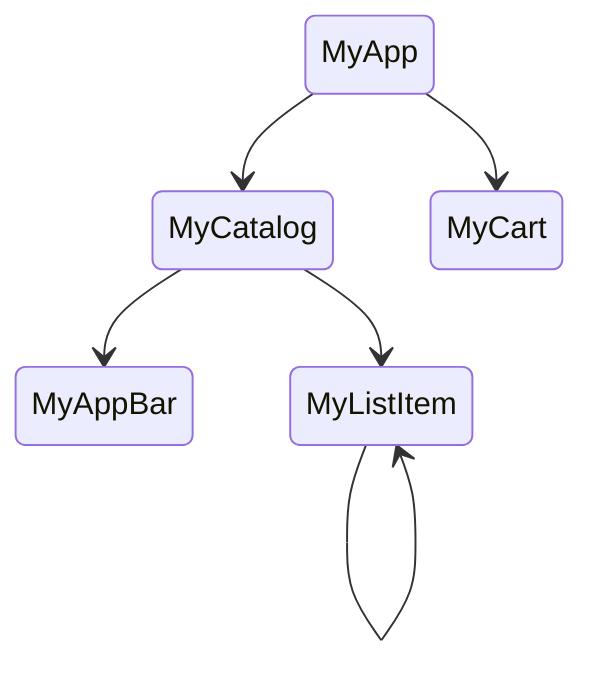

*本記事は下記Flutter公式ドキュメントを学習したメモです。*

# はじめに

FlutterのWidgetは大きく状態を持っているWidget（StatefulWidget）と状態を持たないWidget（StatelessWidget）に分かれる。

効率的にメモリを使い、画面描画をするための仕組みである。

何かのインタラクションにより、もしくはサーバからのレスポンスにより、画面を更新したい時はStatefulWidget、状態を持っているWidgetを使う。

何かのイベントでStatefulWidgetの状態（state）を更新すると、それが検知されたら該当Widgetが再描画される。

過去記事のFlutter Introductionの中で子Widgetのイベントにコールバックを渡してイベント発生でコールバックにより状態を更新したサンプルがある。

簡単に状態を変更できて便利に見えるが、機能が多くなると複雑になる。

本記事は[Flutter公式ドキュメント](https://docs.flutter.dev/data-and-backend/state-mgmt/simple)に紹介されている簡単な状態管理を確認してみる内容である。

# サンプルアプリ概要

サンプルは公式ドキュメントに紹介されている内容と似ている内容で進める。

カタログにアイテムリストが表示されていて、アイテムを選択するとカートにアイテムが移動する。

画面としてはカタログとカートの２つになる。

アプリ・バーもあり、リストはスクロールできるようにする。

Widgetをツリー構造で表したら、下のようになる。



うまく表現できてないが、MyListItemはアイテムが複数並んでいるリストを想像してもらいたい。

上記の構造で状態はどのWidgetで持つのが良いのか。

Flutterでは、状態が変更されるたびに新しいWidgetを構築する。Widgetの特定のメソッドを呼び出すのではなく、コンストラクターを使う。コンストラクターは親Widgetのbuildメソッドでしか呼べないのでMyCartを再描画したいなら、MyCartの親以上の存在が必要になる。

上記の構造ではMyAppが該当する。

MyListItemをMyCartに追加するとMyAppへ状態が更新されMyCartが再構築される流れだ。

# Provider

コールバック以外で選択肢になりある方法の一つがProviderパッケージである。

```shell
flutter pub add provider
```

上のコマンドでパッケージをインストールでき、インポートできるようになる。

Providerを使うには次の３つの概念について理解する必要がある。

- ChangeNotifier：リスナーに変更通知を提供する
- ChangeNotifierProvider：ChangeNotifierのインスタンスを子孫に提供する
- Consumer：提供されたChangeNotifierのインスタンスを使う

# モデル

商品に該当するアイテムについて考えてみよう。

商品を特定するIDがあり、商品名がある。それと値段もある。

写真はメンドなので色にしよう。色もIDによって自動で決めておこう。

/lib/modelsの下にitem.dartファイルを作成してItemクラスを作る。

このクラスは生成されると内容が変わらないのでimmutableにする。

```dart
@immutable
class Item {
  // 商品ID
  final int id;
  // 商品名
  final String name;
  // 商品色
  final Color color;
  // 値段
  final int price;

  Item({
    required this.id,
    required this.name,
  })  : color = Colors.primaries[id % Colors.primaries.length],
        price = Random().nextInt(100) + 1;

  @override
  int get hashCode => id;

  @override
  bool operator ==(Object other) => other is Item && other.id == id;
}
```

後ろの方は他のクラスと比較し、同じItemクラスでIdが一緒なら同じクラスと判断できるようにするものだ。

次は商品を持っているカタログだ。

/lib/modelsの下にcatalog_model.dartファイルを作ってCatalogModelクラスを作る。

カタログモデルは商品名を持って、商品を返却する機能を持っている。

```dart
import 'package:simple_state/models/item.dart';

class CatalogModel {
  static List<String> itemNames = [
    '空腹',
    'ドンカツ',
    'ステーキ',
    '塩サバ',
    'パスタ',
    'ラーメン',
    'オムライス',
    'お好み焼き',
    '焼きそば',
    'うどん',
    'マック',
    'チャーハン',
    'そば',
    'カレー',
    '冷やし中華',
  ];

  // IdでItemを生成して返却する
  Item getById(int id) => Item(id: id, name: itemNames[id % itemNames.length]);

  Item getByPosition(int position) {
    return getById(position);
  }
}
```

次はカートのモデルだ。商品も持っているし、合計金額も出したい。

/lib/modelsの下にcart_model.dartファイルを作ってCartModelクラスを作る。

このクラスはMyAppからカードWidgetに伝達されるからChangeNotifierを相続する。

```dart
import 'package:flutter/foundation.dart';
import 'package:simple_state/models/catalog_model.dart';
import 'package:simple_state/models/item.dart';

class CartModel extends ChangeNotifier {
  late CatalogModel _catalog;

  final List<int> _itemIds = [];

  CatalogModel get catalog => _catalog;

  set catalog(CatalogModel newCatalog) {
    _catalog = newCatalog;
    // 変更されたことを通知する
    notifyListeners();
  }

  List<Item> get items => _itemIds.map((id) => _catalog.getById(id)).toList();

  int get totalPrice =>
      items.fold(0, (total, current) => total + current.price);

  void add(Item item) {
    _itemIds.add(item.id);
    // 変更されたことを通知する
    notifyListeners();
  }

  void remove(Item item) {
    _itemIds.remove(item.id);
    // 変更されたことを通知する
    notifyListeners();
  }
}
```

# カート

公式ドキュメントのイメージを確認してみるとカート画面は大きく、３つで構成されている。

- アプリ・バー
- 商品リスト
- 合計金額

商品リストには商品がリスト表示される。商品リストと合計金額は子Widgetとして別クラスで作成する。

/lib/screens/my_cart.dartファイルを作成してそれぞれクラスを作成する。

まずはカートリストを作る。

```dart
class _CartList extends StatelessWidget {
  @override
  Widget build(BuildContext context) {
    // CartModelの現在状態を取得、CartModelが変更された時、
    // このWidgetを再構築するようにFlutterに指示する
    var cart = context.watch<CartModel>();
    // テキストスタイル
    var itemTextStyle = const TextStyle(
      fontWeight: FontWeight.w700,
      fontSize: 24,
      color: Colors.black,
    );

    return ListView.builder(
      itemCount: cart.items.length,
      itemBuilder: (context, index) => ListTile(
        leading: Icon(
          Icons.shopping_cart_outlined,
          color: Colors.amber.shade600,
        ),
        trailing: IconButton(
          icon: const Icon(Icons.remove_circle_outline, color: Colors.red),
          onPressed: () {
            cart.remove(cart.items[index]);
          },
        ),
        title: Text(
          '${cart.items[index].name}  \$${cart.items[index].price}',
          style: itemTextStyle,
        ),
      ),
    );
  }
}
```

合計金額も別部品で作るが、CartModelに変更があったら、再描画するようにする。

今回はWidgetの再構築ではなく、Cosumerを使って該当部分のみ再描画するようにする。

```dart
class _CartTotal extends StatelessWidget {
  @override
  Widget build(BuildContext context) {
    // テキストスタイル
    var totalTextStyle = const TextStyle(
      fontWeight: FontWeight.w700,
      fontSize: 48,
      color: Colors.black,
    );

    return SizedBox(
      height: 200,
      child: Center(
        child: Row(
          mainAxisAlignment: MainAxisAlignment.center,
          children: [
            // Consumer Widgetを使って価格表示のみ再描画する
            Consumer<CartModel>(
              builder: (context, cart, child) => Text(
                '\$${cart.totalPrice}',
                style: totalTextStyle,
              ),
            ),
            const SizedBox(width: 24),
            FilledButton(
              onPressed: () {
                ScaffoldMessenger.of(context).showSnackBar(
                  const SnackBar(content: Text('まだ購入機能はありませんよ。')),
                );
              },
              style: TextButton.styleFrom(foregroundColor: Colors.white),
              child: const Text('購入'),
            ),
          ],
        ),
      ),
    );
  }
}
```

いよいよ、カード画面だ。

```dart
class MyCart extends StatelessWidget {
  const MyCart({super.key});

  @override
  Widget build(BuildContext context) {
    return Scaffold(
      appBar: AppBar(
        title: const Text(
          'カート',
          style: TextStyle(
            fontWeight: FontWeight.w700,
            fontSize: 24,
            color: Colors.black,
          ),
        ),
        backgroundColor: Colors.white,
      ),
      body: Container(
        color: Colors.yellow,
        child: Column(
          children: [
            Expanded(
              child: Padding(
                padding: const EdgeInsets.all(32),
                child: _CartList(),
              ),
            ),
            const Divider(height: 4, color: Colors.black),
            _CartTotal(),
          ],
        ),
      ),
    );
  }
}
```

# カタログ

カタログ画面は大きく２つで構成される。アプリ・バーとリストだ。

今回は以前Layout記事で扱っていたスクロールによって見えなくアプリ・バーにして商品が多く見えるようにする。

商品リストの各商品アイテムにはカートに追加するボタンを追加する。

アプリ・バーにはカートボタンを設けてカートの内容が見られるようにする。

/lib/screensの下にmy_catalog.dartファイルを作る。

まずはカートに追加するボタンだ。

```dart
class _AddButton extends StatelessWidget {
  final Item item;

  const _AddButton({required this.item});

  @override
  Widget build(BuildContext context) {
    // CartModel変更を検知するリスナー
    var isInCart = context.select<CartModel, bool>(
      (cart) => cart.items.contains(item),
    );

    return TextButton(
      onPressed: isInCart
          ? null // カートに商品があれば何もしない
          : () {
              // カートに商品がなかったら、カートに追加
              var cart = context.read<CartModel>();
              cart.add(item);
            },
      style: ButtonStyle(
        overlayColor: MaterialStateProperty.resolveWith<Color?>((states) {
          if (states.contains(MaterialState.pressed)) {
            return Theme.of(context).primaryColor;
          }
          return null;
        }),
      ),
      child: isInCart
          ? const Icon(Icons.check, semanticLabel: '追加済')
          : const Text('追加'),
    );
  }
}
```

追加ボタンを作ったのでリストを作成してみよう。

```dart
class _MyListItem extends StatelessWidget {
  final int index;

  const _MyListItem(this.index);

  @override
  Widget build(BuildContext context) {
    // indexのみ監視
    var item = context.select<CatalogModel, Item>(
      (catalog) => catalog.getByPosition(index),
    );
    // テキストスタイル
    var textStyle = const TextStyle(
      fontWeight: FontWeight.w700,
      fontSize: 24,
      color: Colors.black,
    );
    return Padding(
      padding: const EdgeInsets.symmetric(horizontal: 16, vertical: 8),
      child: LimitedBox(
        maxHeight: 48,
        child: Row(
          children: [
            AspectRatio(
              aspectRatio: 1,
              child: Container(
                color: item.color,
              ),
            ),
            const SizedBox(width: 24),
            Expanded(
              child: Text(
                '${item.name} \t (\$${item.price})',
                style: textStyle,
              ),
            ),
            const SizedBox(width: 24),
            _AddButton(item: item),
          ],
        ),
      ),
    );
  }
}
```

次はアプリ・バーだ。

```dart
class _MyAppBar extends StatelessWidget {
  @override
  Widget build(BuildContext context) {
    return SliverAppBar(
      title: const Text(
        'カタログ',
        style: TextStyle(
          fontWeight: FontWeight.w700,
          fontSize: 24,
          color: Colors.black,
        ),
      ),
      floating: true,
      actions: [
        IconButton(
          icon: const Icon(Icons.shopping_cart),
          onPressed: () => context.go('/catalog.cart'),
        ),
      ],
    );
  }
}
```

まとめだ。MyCatalogクラスを作る。

```dart
class MyCatalog extends StatelessWidget {
  const MyCatalog({super.key});

  @override
  Widget build(BuildContext context) {
    return Scaffold(
      body: CustomScrollView(
        slivers: [
          _MyAppBar(),
          const SliverToBoxAdapter(child: SizedBox(height: 12)),
          SliverList(
            delegate: SliverChildBuilderDelegate(
              (context, index) => _MyListItem(index),
            ),
          ),
        ],
      ),
    );
  }
}
```

# ログイン

公式ドキュメントでサンプルのイメージを見ればログイン画面があった。サンプルのレポジトリを参考にして作る。

/lib/screensの下にmy_login.dartファイルを作ってMyLoginクラスを作る。

```dart
import 'package:flutter/foundation.dart';
import 'package:flutter/material.dart';

class MyLogin extends StatelessWidget {
  const MyLogin({super.key});

  @override
  Widget build(BuildContext context) {
    return Scaffold(
      body: Center(
        child: Container(
          padding: const EdgeInsets.all(80),
          child: Column(
            mainAxisAlignment: MainAxisAlignment.center,
            children: [
              const Text(
                'いらっしゃい！',
                style: TextStyle(
                  fontWeight: FontWeight.w700,
                  fontSize: 24,
                  color: Colors.black,
                ),
              ),
              TextFormField(
                decoration: const InputDecoration(
                  hintText: 'ログインID',
                ),
              ),
              TextFormField(
                decoration: const InputDecoration(
                  hintText: 'パスワード',
                ),
                obscureText: true,
              ),
              const SizedBox(height: 24),
              ElevatedButton(
                onPressed: () {
                  context.pushReplacement('catalog');
                },
                style: ElevatedButton.styleFrom(
                  backgroundColor: Colors.yellow,
                ),
                child: const Text('ログイン'),
              ),
            ],
          ),
        ),
      ),
    );
  }
}
```

# まとめ

いよいよmain関数だ。

サンプルソースにはウェブ、Windows,MacOSの場合の画面サイズを定義する機能があるが、ここではモバイルのみにするので省略する。

また、画面が３つあるのでそれをルーティングする必要がある。

main.dartファイルにはルーティング関数を含める。

go_routerパッケージを使うので追加しておこう。

```shell
flutter pub add go_router
```

ルーティング関数の内容だ。

```dart
GoRouter router() {
  return GoRouter(
    // 初期画面
    initialLocation: '/login',
    routes: [
      GoRoute(
        path: '/login',
        builder: (context, state) => const MyLogin(),
      ),
      GoRoute(
        path: '/catalog',
        builder: (context, state) => const MyCatalog(),
        // カタログの下位ルーティング
        routes: [
          GoRoute(
            path: 'cart',
            builder: (context, state) => const MyCart(),
          ),
        ],
      ),
    ],
  );
}
```

次にMyAppだ。

```dart
class MyApp extends StatelessWidget {
  const MyApp({super.key});

  @override
  Widget build(BuildContext context) {
    // 複数のオブジェクトを使うためにMultiProviderを使う
    return MultiProvider(
      providers: [
        Provider(create: (context) => CatalogModel()),
        ChangeNotifierProxyProvider<CatalogModel, CartModel>(
          create: (context) => CartModel(),
          update: (context, catalog, cart) {
            if (cart == null) throw ArgumentError.notNull('cart');
            cart.catalog = catalog;
            return cart;
          },
        ),
      ],
      child: MaterialApp.router(
        title: 'Provider Demo',
        routerConfig: router(),
      ),
    );
  }
}
```

# スクリーンショット


# 最後に

より詳細に確認したい人は[公式ドキュメント](https://docs.flutter.dev/data-and-backend/state-mgmt/simple)とサンプルコードの[レポジトリ](https://github.com/flutter/samples/tree/main/provider_shopper)をご参考いただきたい。
