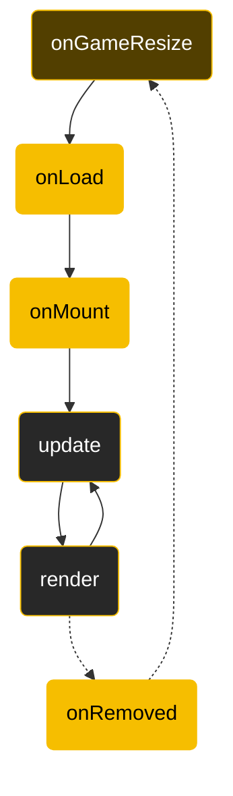
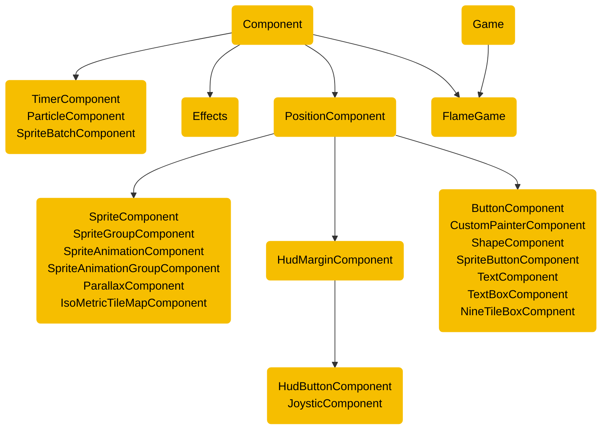

*本記事はFlame公式ドキュメントを学習した内容を整理しています。*

# Flameとは

FlameはFlutterゲームエンジンでFlutterが提供するインフラストラクチャを活用しながら、プロジェクトの構築に必要なコードを簡素化する。

Flameはシンプルで効果的なゲームループの実装と、ゲームに必要な機能を提供する。入力、画像、スプライト、スプライトシート、アニメーションなどの操作、衝突検出とFCS(Flame Component System)と呼ばれるコンポーネントシステムを提供する。

# GameWidget

GameWidgetは、FlutterウィジェットツリーにGameインスタンスを挿入するために使用されるFlutterウィジェットだ。

GameWidgetはFlutterアプリケーションのルーツとしても実行できる。

```dart
void main() {
    runApp(
        GameWidget(game: MyGame()),
    );
}
```

GameWidgetは通常のFlutterウィジェットであり、1つのアプリ内に複数のGameWidgetを持つこともできる。上のコードのようにルートウィジェットとして使用すると、アプリが全画面表示になる。

GameWidgetは次の機能をサポートする。

- loadingBuilder：ゲームのロード中に何か表示できる。
- errorBuilder：ゲームがエアーをスローした場合に表示できる。
- backgroundBuilder：ゲームの背景を描画できる。
- overlaBuilderMap：ゲームの上に1つ以上のウィジェットを描画できる。

# FlameGameクラス

FlameGameクラスは、コンポーネントベースのゲームを実装する。このコンポーネントのシステムを、Flame Component Systemu（FCS）と呼ぶ。FlameGameクラスは、コンポーネントツリーがあり、ゲームに追加されたすべてのコンポーネントのupdateメソッドとrenderメソッドを呼び出す。

## ライフサイクル



FlameGameが最初にGameWidgetを追加されると、`onGameResize`、`onLoad`、`onMount`の順で呼び出される。その後ゲームティックごとに`update`と`render`が順番に呼び出される。FlameGameがGameWidgetから削除されると`onRemove`が呼び出される。

`onGameResize`は追加された時とリサイズされた時のみ、`onLoad`と`onMount`は最初の１回のみ、`onRemove`は削除されるときの１回のみ、`update`と`render`は毎ティックごとに呼び出される。

# コンポーネント



すべてのコンポーネントはComponent抽象クラスを継承し、他のコンポーネントを子として持つことができる。

子コンポーネントは`add`メソッドを使って追加するかコンストラクターで渡して追加する。

## コンポーネントのライフサイクル

コンポーネントのライフサイクルはFlameGameのライフルサイクルと似ている。


`onGameResize`メソッドは、画面のサイズが変更されるたびに呼び出される。コンポーネントツリーに追加されるときに`onMount`メソッドの前に呼び出される。

`onRemove`メソッドは、コンポーネントがゲームから削除される前にコードを実行するようにオーバーライドできる。

`onLoad`メソッドをオーバーライドして、画像のロードなど、コンポーネントの非同期初期化コードを実行できる。１回のみ呼び出されるため、非同期コンストラクターと考えることができる。

`onMount`メソッドは、コンポーネントがゲームツリーにマウントされるたびに実行される。これは何度も実行される可能性があるため、`late`変数の初期化を行うべきではない。

`onChildrenChanged`メソッドは、子コンポーネントの変更を検出する必要がある場合、オーバーライドできる。子が親に追加される時と削除される時、その度に呼び出される。

コンポーネントのライプサイクル状態は次のゲッターで確認できる。

- isLoaded：現在のロード状態をブール値で返却する。
- loaded：ロードが完了するとFutureで返却する。
- isMounted：現在のマウント状態をブール値で返却する。
- mounted：マウントが完了するとFutureで返却する。
- isRemoved：現在の削除状態をブールで返却する。
- removed：削除が完了するとFutureで返却する。

## Priority

すべてのコンポーネントにはpriorityプロパティがあり、CSSのz-indexのように使える。

コンポーネントツリーの中で並べ替え順序を決めるもので、優先順位を高くすると優先順の低いコンポーネントより上に描画される。
