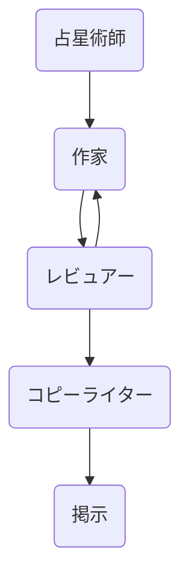

長い期間ブログ更新ができてなかった。

仕事が忙しかったこともあり、Flutterを使ったアプリより、AIに興味が沸いたからだ。

AIについて色々勉強して何か作れないかと思い、GW期間から企画と開発を進めてやっと一つ形にすることができたのでここに共有する。

## AI占星術師のリナ

何を作ろうか悩んだ末に思いついたのが、何か人に役立つコンテンツを生成して配信するのはどうかと思った。

AIでできるところが多いと思い、最初は自己啓発を含め、いくつかのカテゴリのコンテンツを日本語、英語、韓国語で配信することを考えたが、

開発を進める中でトークン使用量が多くなり、個人で支払うのは負担になったのでまずはスモールスタートとして占いとしている。

単に占いを配信するのはいろんな占いサイトと差がなく、人の役に立つかも微妙であったが、

人が読んでポジティブになるような、日常的に実用的なアドバイスを提供するのはどうかと思ってそれを目指して開発した。

タイトルの名前から分かるように女性の人格を持たせてコンテンツを作成させている。

おっさんなのに女性と思う方もいらっしゃるかもしれないが、単に親しみやすく、優しく伝えたかったという気持ちでAIに女性のペルソナを入れてコンテンツを作成している。

なのでおっさんの私が女の子に見せかけて運営するわけでなく、女の子の人格のAIがブログを運営するのである。

## どんなふうに作った？

今回のブログはまずは素早く使えるものを世の中に出したい気持ちから大きく二つのシステムを構成して開発した。

一つ目はWebシステム、二つ目はコンテンツ生成システムだ。

### Webシステム

WordPressという選択肢もあったが、せっかくPythonを使うので０ベースから作ってみたい気持ちがあった。

DjangoとFlaskの中で素早く開発できる点から、Flaskを使ってブログシステムを作った。

開発中、方向性の違いから３回ほど作り直したが、それほど時間は掛からなかった。

全体の実工数は0.5人月ほどであるが、Flaskによる開発は1/4ほどではないかと思われる。

途中で柔軟に対応できるようにと、Next.jsとFastAPIに変えたい気持ちもあったが、

リリースを優先してFlaskで開発している。

クラウド上ではWebサーバーとしてNginXとGunicornでサービスしている。

### コンテンツ生成システム

LLMが流行り出してその中で代表格なChatGPTを使ったことある方は多いと思う。

最初はしょぼい回答であまり興味が沸かなかった方もいらっしゃるかもしれないが、

ChatGPTというのは会話内容が保存されていて会話するほど希望に近い回答を得られるようになる。

今回のシステムはChatGPTではないが、OpenAIのAPIを使っていて同じく、１回に希望しているような結果を出すのは難しいのではと思う。

それでマルチ・エイジェント（Multi-agent）方式を使って開発している。

エイジェントというのは、一つの作業と見ても良いであろう。

一つのエイジェントが作業した結果を他のエイジェントの入力として流して結果の精度を上げる。

また、レビュアーエイジェントを置いてレビューし、フィードバックしてさらに精度を上げるようなイメージだ。

下記が、その流れである。

マルチ・エイジェントを構築するにはいくつかのフレームワークが存在している。

- LangGraph(LangChain)
- CrewAI
- AutoGen

CrewAIとAutoGenは似たような使い方で簡単にマルチ・エイジェントを構成することができるが、細かいプロンプトの調整は難しそうに感じたので今回のプロジェクトではLangGraphを採用している。

LangGraphでエイジェントのワークフローを構成するのは比較的簡単であるが、その中身であるエイジェントは色々選択肢がまた出てくる。

単純にAIのAPIを呼び出して使うか、LangChainのAgentを構成して使うか、OpenAIのAssistantを使うか、

また、モデルはOpenAIを使うか、Geminiを使うか、Claudeを使うかなどだ。

今回、一つの基準になったのが、費用である。

Geminiが一番安いが、すでにOpenAIのAPIに決済してあるので費用を増やさずに進めるためにOpenAIのままにしている。

LangChainでAgentを作成してTavilyを追加することでより、精度の高いものを出せることもできたけど、そこまでは不要と思ったので単純にOpenAIのAPI呼び出しを構成した。

方針を決めて結果をチェックしながら、開発を進めたが、マルチ・エイジェント構成もそんなに時間がかからないけど

気に入る結果になるまでプロンプトを微調整するのが一番時間がかかって全体工数の半分以上ではないかと思う。

### その他

二つの構成で開発を進めて他に時間がかかったところはデザインだね。

システム開発に関わってきて企業系システムだからデザインすることには経験がなかったからだ。

ネットでフリーのサンプルを真似しながら、なんとか作っている。

使っているイメージは全てChatGPTで作成している。

## 最後に

色々、話したけど、ここで今回作った「リナの部屋」という名前の星占いブログを共有する。

[リナの部屋](https://linasroom.com)

今後は今回使った技術を共有するのと他に何を作るか考えてみたいと思う。