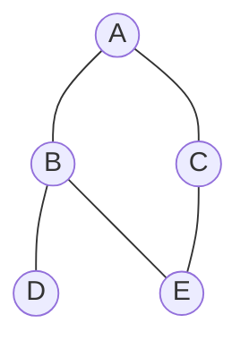
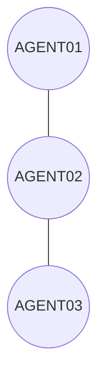

LangGraphは私が作った[リナの部屋](https://linasroom.com)で使用したフレームワークで

LangChainで提供するフレームワークでマルチ・エイジェントを構成しやすくするものだ。

今回は、LangGraphそのものを理解するためにLLMなしで構成してみることにする。

## Graph

みなさんはグラフ構造というのをご存知だろうか。

ノードとノードを連結するエッジで構成されるデータ構造である。



上の図形で円がノード（Node）、円と円をつなぐのがエッジ（Edge）である。

LangGraphは、ノードを作業を行うエイジェントとしてノードを作ってノードとノードを繋げられる仕組みを提供してくれる。

## とにかくコードを書いてみよう。

今回はLLMは使わずに三つのエイジェントがあると想定して次のような構造を構成してみる。



### 環境構築

LangGraphでいろんな種類のGraphがあるが、私が使ったのはStateGraphで一番わかりやすかったためである。

今回もStateGraphを使ってLangGraphを触ってみることにする。

まずはプロジェクトフォルダを作ろう。

```shell
% mkdir langgraph_no_llm_ex
% cd langgraph_no_llm_ex
```

わかっていらっしゃると思うが、フォルダ名は私が勝手につけているので読者の皆さんは好きにすれば良いかと。

Pythonを使うための仮想環境を作って活性化しよう。

```shell
% python3 -m venv .venv
% source .venv/bin/activate
```

上記のコマンドの2行目はMacOS用なのでWindowsを使っている方は.venv/Scripts/activateを実行すれば良いと思う。

今回の内容で必要なパッケージをインストールする。

```shell
(.venv) % pip install langgraph httpx json5
```

langgraphは必須であるが、httpxとjson5は必須ではない。

私の場合は、実行時にhttpxがないとエラーになったので追加している。

json5は特に必要なく、jsonを使っても良いが、今回のプロジェクトで使ってたので習慣になっている。

### エイジェントクラス

グラフ構造のノードに該当するエイジェントクラスを作ってみよう。

みなさんは私と同じように構成する必要はないが、私が開発した構成で進める。

まずは親クラスである。

agentsフォルダを作成してその中にbase.pyファイルを作る。

その中身を次の内容になる。

```python
# agents/base.py
class BaseAgent:
  def __init__(self, name: str) -> None:
    self.name = name
  
  def call_model(self, prompt:str):
    return f"これは[{prompt}]の結果です。"
```

今回のコンストラクターは飾りに近いが、開発する際にはコンストラクターで環境変数をロードしている。

call_model関数は実際にはLLMのAPIを呼び出すか、LangChainでエイジェントを構成したものを呼び出すようにしている。

今回はLLMなしでLangGraphのみをみるので簡単に文字列を返すようにしている。

次は最初のエイジェントだ。agentsフォルダにagent01.pyファイルを作って次のコードを書こう。

```python
# agents/agent01.py
from . import BaseAgent

class Agent01(BaseAgent):
    
  def run_agent(self, state: dict):
    query = state.get('query')
    print(f"{self.name} Start:\n{query}")
    result = self.call_model(query)
    print(f"{self.name}'s Result:\n{result}")
    return {"agent01_result": result}
```

そんなに内容はない。関数名は好きな名前で良いが、パラメータの"state: dict"は必須である。

stateの名前も好きにして良いが、タイプは必ずdictでなければ、ならない。

理由はLangGraphで構成してエイジェント間で情報を渡しているが、それがStateGraphであり、辞書型であるためだ。

今後、出てくるが、そこから情報を取得して入力として使う。

その後のコードは見ての通り、開始と終了を出力するのとモデル（LLM）に該当する機能を呼び出している。

リターンはStateGraphで指定している名前で辞書型で返す必要がある。

LangGraphではノードとノードの間、情報を共有していてそれをステート（State）と呼ぶ。

なのでパラメータの名前はstateかstateがついた名前になっている。

次の二つのエイジェントは同じのような内容なので次のように作成しよう。

```python
# agents/agent02.py
from . import BaseAgent

class Agent02(BaseAgent):
    
  def run_agent(self, state: dict):
    query = state.get('agent01_result')
    print(f"{self.name} Start:\n{query}")
    result = self.call_model(query)
    print(f"{self.name}'s Result:\n{result}")
    return {"agent02_result": result}
```

次は最後のエイジェントだ。

```python
# agents/agent03.py
from . import BaseAgent

class Agent03(BaseAgent):
    
  def run_agent(self, state: dict):
    query = state.get('agent02_result')
    print(f"{self.name} Start:\n{query}")
    result = self.call_model(query)
    print(f"{self.name}'s Result:\n{result}")
    return {"agent03_result": result}
```

三つのエイジェントクラスを作ってみたが、それぞれエイジェントの入力と返しを注目してほしい。

実際にマルチ・エイジェントを構成する時には該当エイジェントに合わせて入力を渡して次のエイジェントが必要なものを返すことになる。

最後に、agentsフォルダをパッケージのように使うため、`__init__.py`ファイルを追加するのを忘れないで欲しい。

```python
# agents/__init__.py
from .base import BaseAgent
from .agent01 import Agent01
from .agent02 import Agent02
from .agent03 import Agent03

__all__ = [
  'BaseAgent',
  'Agent01',
  'Agent02',
  'Agent03',
]
```

### ステート（State）

次はエイジェント（ノード）とエイジェント（ノード）が共有するステートクラスを作ってみよう。

プロジェクトルートにmemoryフォルダを作成してagent.pyというファイルを作って次の内容を書こう。

```python
# memory/agent.py

from typing import TypedDict

class AgentState(TypedDict):
  query: str
  agent01_result: str
  agent02_result: str
  agent03_result: str
```

ステートは辞書型になるのでTypedDictを継承して宣言する。

その後、エイジェント（ノード）間、やり取りする内容を定義する。

要素の名前とエイジェントクラスで入力と返しの内容を確認して欲しい。

エイジェント（ノード）の入力と返しの内容は全てこのクラスで定義されている必要がある。

今回は文字列のみだけど、必要に応じていろんなタイプもできる。

文字列の配列ならList[str]、辞書型ならdict、辞書型の配列ならList[dict]などだ。

これも同じく`__init__.py`を追加しておこう。

```python
# memory/__init__.py
from .agent import AgentState

__all__ = ["AgentState"]
```

フォルダをパッケージのように使うには`__init__.py`ファイルのみ作成して中にはノーコードでも良いが、私は上のように定義した方が参照しやすかったので上記のようにしている。

### マネージャ

人によって呼び方は様々でマスターと呼んでいる人もいるが、私はマネージャとしている。

何をマネージャと呼んでいるかというと上で作ったエイジェントをまとめて使うものである。

プロジェクトルートフォルダにmanager.pyファイルを作成しよう。

ここはラインごとに説明していく。

まずはインポートだ。

```python
import json5 as json
from langgraph.graph import StateGraph, END

from agents import Agent01, Agent02, Agent03
from memory import AgentState
```
json5は便利機能として追加しているので必須ではない。

次がLangGraphをインポートしている。

Graphというのもあるが、自分でステートを定義できるStateGraphがわかりやすかったので私はStateGraphを使っている。

ENDは明示的に最後のノードであることを示すために使う。

その次は今まで作成したクラスをインポートしている。

次はクラス宣言だ。

```python
class TestAgentManger:
  def __init__(self) -> None:
    pass

  def run_workflow(self):
```

コンストラクターは飾りでrun_workflow関数の中に構成していく。

まずは上で作ったエイジェント達を使えるように宣言する。
```python
    agent01 = Agent01(name='Agent01')
    agent02 = Agent02(name='Agent02')
    agent03 = Agent03(name='Agent03')
```

BaseAgentのコンストラクターで名前を設定するようにしているのでそれぞれ名前を指定している。

次は、LangGraphの宣言だ。

```python
    workflow = StateGraph(AgentState)
```

StateGraphなので上で作成したAgentステートを渡している。

これでエイジェント（ノード）間でAgentステートを共有できるようになる。

次のコードからは大事なところである。最初のグラフ構造で話しているようにノードとノードをつなぐエッジで構成される。

まずはノードの追加だ。

```python
    workflow.add_node('agent01', agent01.run_agent)
    workflow.add_node('agent02', agent02.run_agent)
    workflow.add_node('agent03', agent03.run_agent)
```

一つ目のパラメータはノードの名前である。二つ目はノードになる呼び出せる関数を指定する。

今回はクラス一つに一つの関数だったので上のような形をしているが、クラスに複数の機能があれば、それぞれ違う名前でノードを追加することもできる。

次はノードとノードを連結するエッジを追加する。

```python
    workflow.add_edge('agent01', 'agent02')
    workflow.add_edge('agent02', 'agent03')
    workflow.add_edge('agent03', END)
```

一つ目のパラメータは開始ノード、二つ目のパラメータは到着ノードである。

名前は上で追加したノードの名前である。

3行目で見ればわかるように終了ノードとしてENDを使っている。

ENDを使わなくても終わりを設定する方法もあるが、私は明示的にENDを使うのを好む。

エントリーポイント、すなわち全体フローの中で開始ノードを指定することだ。

```python
    workflow.set_entry_point('agent01')
```

私はこのエントリーポイント設定をよく忘れてエラーが出てなんでだろうと時間がかかったことが多い。

上記までが流れなので忘れないで欲しい。

残るのは上記で設定した内容を使えるようにすることだ。

```python
    team = workflow.compile()
```

公式ドキュメントとかではLangChainのようにchainとなっているけど、複数のエイジェントを一つにまとめているので私はteamの変数名を好む。

ただの好みなのでみなさんは好きにすれば良い。

やっとマルチ・エイジェントを呼び出すところまできた。

```python
    result = team.invoke({"query": "Agent Workflow!"})
```

渡しているパラメータをみて欲しい。Agentステートで定義して最初のAgent01で受け取るものを設定している。

これの返却値はエイジェント全体を通してそれぞれの値が保存されたAgentステートである。

次は全体のコードだ。

```python
# manager.py
import json5 as json
from langgraph.graph import StateGraph, END

from agents import Agent01, Agent02, Agent03
from memory import AgentState

class TestAgentManger:
  def __init__(self) -> None:
    pass

  def run_workflow(self):
    agent01 = Agent01(name='Agent01')
    agent02 = Agent02(name='Agent02')
    agent03 = Agent03(name='Agent03')

    workflow = StateGraph(AgentState)

    workflow.add_node('agent01', agent01.run_agent)
    workflow.add_node('agent02', agent02.run_agent)
    workflow.add_node('agent03', agent03.run_agent)

    workflow.add_edge('agent01', 'agent02')
    workflow.add_edge('agent02', 'agent03')
    workflow.add_edge('agent03', END)

    workflow.set_entry_point('agent01')

    team = workflow.compile()

    result = team.invoke({"query": "Agent Workflow!"})

    print(json.dumps(result, indent=2, ensure_ascii=False))
```

### 実行！

最後は上で作成したファイルを実行するためのmain.pyファイルを作成して実行してみよう。

```python
# main.py
from manager import TestAgentManger

def main():
    manager = TestAgentManger()
    manager.run_workflow()

if __name__ == '__main__':
    main()
```

じゃあ、実行してみよう。

```shell
(.venv) % python3 ./main.py
```

次のような結果になるだろうか。

```text
Agent01 Start:
Agent Workflow!
Agent01's Result:
これは[Agent Workflow!]の結果です。
Agent02 Start:
これは[Agent Workflow!]の結果です。
Agent02's Result:
これは[これは[Agent Workflow!]の結果です。]の結果です。
Agent03 Start:
これは[これは[Agent Workflow!]の結果です。]の結果です。
Agent03's Result:
これは[これは[これは[Agent Workflow!]の結果です。]の結果です。]の結果です。
{
  query: "Agent Workflow!",
  agent01_result: "これは[Agent Workflow!]の結果です。",
  agent02_result: "これは[これは[Agent Workflow!]の結果です。]の結果です。",
  agent03_result: "これは[これは[これは[Agent Workflow!]の結果です。]の結果です。]の結果です。",
}
```

出力結果から、順次にエイジェントが実行され、Agentステートが共有されていることがわかる。

最後のところを見やすくするために、今回はjson5を使ったのである。

最後の結果からも全ての結果が含まれていることがわかる。

## 最後に

今まで見てきたのがマルチ・エイジェントを構成するためのLangGraphの使い方である。

LLMを使わずにLangGraphだけを見た方が分かりやすいと思ったので今回はLLMなしのバージョンで説明したが、次回は実際にLLMも使ってマルチ・エイジェントを構成する方法を説明していきたい。

