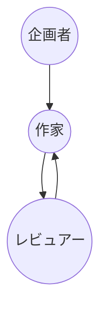

前回の記事でLangGraphの基本をさらっと確認してみましたが、今回はLLMを使った実例を見ていきます。

今回の記事は次のような前提知識があれば良いかなと思います。

- Python：基本的な使い方、文法がわかれば理解しやすいかな。
- LangChain: LangChainを学習したとか、LangChainを使ってみたとか少し知識があれば理解しやすいかと。
- LangGraph: 前回の記事を参考すれば良いかな。

私もPythonを使って専門的に開発に関わっているわけでもなく、何年か前に興味本位でさらっとみただけです。

それが今回の[リナの部屋](https://linasroom.com)プロジェクトやりながら、もうちょっと覚えるようになったぐらいで多くはChatGPT先生に聞きながら、進めました。

最初から全部を覚えるよりはまずは少しずつ慣れていきましょう。

今までのブログ記事と私が思う私とイメージがあってない気がするのでトーンを変えていきます。

## はじめに

前回の記事でLangGraphの基本的な流れは確認してみましたので今回はLLMを使った本物のMulti-agentシステムを作ってみます。

今回、開発するPythonのバージョンは下のようになっています。

```shell
% python3 --version
Python 3.12.3
```

同じじゃなくてもいけると思いますが、3.12であれば良いかなと思います。

今回はLLMを使うということで二つ必要なものがあります。

それはOpenAIとTavilyのAPIキーです。

他のLLMのキーをお持ちでしたら、それに合わせてコードを変更しても良いかと思います。

Tavilyの場合は検索APIで１ヶ月1000リクエストまで無料で使えるので勉強する時は助かりますね。

もちろんTavily以外のSERP-APIでも良いですが、今回の記事はTavily基準で進めるので必要に応じてコードを修正してください。

次はOpenAIとTavilyのAPIキーを取得するところを少し確認していきます。

### OpenAI API Key

OpenAIのAPIを使うにはOpenAIのAPIにアカウントを登録する必要があります。ChatGPTとは別アカウントになりますのでなければアカウント登録が必要です。

[OpenAI](https://openai.com/)ホームページのメニューにある"Products>API login"を選択します。その後はChatGPTかAPIか選択する画面があるのでAPIを選択します。

ダッシュボードが表示されたら、左側のAPI keysを選択します。


API keys画面の右上に緑の"Create new secret key"ボタンをクリックします。


API keyの名前を入力するようになっているので名前を好きに入力して右下の"Create secret key"ボタンをクリックしてキーを生成します。


次は注意が必要です。API keyはこの画面でしか確認できなく、この画面を閉じたら確認できるところがないので忘れたら、再度作成するしかないです。"Copy"ボタンでキーをコピーしてどこかに保存しておきましょう。

キーをコピーしたら、"Done"ボタンで画面を閉じます。


このAPIキーは大事に保管しましょう。SNSとか他の人と共有しない方が良いと思います。支払い情報を登録されている方は使ってもないのに実際に支払いが発生する可能性があるからです。

もし、今回初めて登録された人は支払い情報を登録しなくても$5ほど使えるクレジットが発行されていると思いますので実習はできるかと思います。ただし、トライアル期間で使えるモデルは"gpt-3.5-turbo"のみと思いますのでコードのモデルのところを"gpt-3.5-turbo"にしてください。

### Tavily API key

Tavliyの仕組みまでは調べてないですが、LangChainドキュメントでよく載っていたので使ってみました。１ヶ月1000リクエストまで無料で使えるので大変助かりますね。

TavilyのAPIキーを取得してみましょう。

Tavilyで検索すると上位に出てくるのでクリックしてホームページをみてみましょう。


画面の真ん中にある"Get Started"ボタンをクリックします。


ログインするようにと表示されるので"Sign In"ボタンをクリックします。


次はGoogleかGitHubアカウントでログインするように出てきます。私はGoogleアカウントでログインしました。


次は記憶が曖昧ですが、すでにキーが用意されいたと思いますが、もしない方は画面上にCreate keyなどのボタンがあると思うのでそれをクリックしてキーを生成してください。


OpenAIとは違ってTavilyのキーは一つのみなのでいつでもコピーすることができます。

これで準備は終わりましたので次は今回進める全体像を確認してみます。

## 全体像

前回のLangGraphでは三つのエイジェントを構成して一方通行でしたが、通常のMulti-Agentでは[Reflection](https://www.deeplearning.ai/the-batch/agentic-design-patterns-part-2-reflection/?ref=dl-staging-website.ghost.io)というパターンが必要です。簡単にいうとフィードバックですね。

今回はフィードバックもできるように構成したいと思います。

次のような構成で進めていきます。



- 企画者：記事を企画するエイジェントです。キーワード、トピックを与えたら、検索して記事を企画します。
- 作家：企画者の企画をもとに記事を作成します。上のグラフのようにレビュアーからフィードバックがあったら、修正することもできるようにします。
- レビュアー：作家が作成した記事をレビューします。問題がなかったら、処理を終了します。

簡単ですが、この流れでMulti-Agentの基本は抑えることができるかと思います。

私がMulti-Agentを作成するにあたって一番参考になったレポジトリが二つありますので合わせて紹介しておきます。

一つ目は、LangChainブログの下の記事で紹介されている"[GPT-Newspaper](https://github.com/rotemweiss57/gpt-newspaper?ref=blog.langchain.dev)"です。

> [LangGraph: Multi-Agent Workflows](https://blog.langchain.dev/langgraph-multi-agent-workflows/)

二つ目は、同じくLangChainブログの下の記事で紹介されている[GPT Researcher](https://gptr.dev/?ref=blog.langchain.dev)レポジトリに含まれいる[multi_agents](https://github.com/assafelovic/gpt-researcher/tree/master/multi_agents?ref=blog.langchain.dev)です。

> [How to Build the Ultimate AI Automation with Multi-Agent Collaboration](https://blog.langchain.dev/how-to-build-the-ultimate-ai-automation-with-multi-agent-collaboration/)

レポジトリを確認してみるとわかると思いますが、前回構成したコードが結構似ているのは上の二つを真似しているからです。

それでは、実際にコードを作成してみましょう。

## Multi-Agentの記事作成チームを作ろう。

### 環境構築

いつものように環境構築から始めます。

まず、プロジェクトフォルダを作って仮想環境を作りましょう。

```shell
% mkdir langgraph_with_llm_ex
% cd langgraph_with_llm_ex
% python3 -m venv .venv
% source .venv/bin/activate
```

次は必要なパッケージをインストールします。

```shell
(.venv) % pip install langchain langchain-community langchain-openai langgraph json5 python-dotenv
```

一旦思いつくのはこれぐらいですけど、作成しながら、必要なものがあれば、追加していきます。

じゃあ、コードを作成していきましょう。私はVSCodeを使っています。

```shell
(.venv) % code .
```

Githubで提供しているCopilotは使いたいけど、有料なので手が出ないですが、AWSで提供するAWS Toolkitエクステンションを入れるとAmazon Qが使えるのですが、そこそこ便利ですのでみなさんもよかったら使ってみてください。

### フォルダ構成

フォルダ構成は概ね前回のものと同じになりますが、`.env`ファイルが追加されます。

```text
project-root/
          ├─ agents/
          │  ├─ __init__.py
          │  ├─ base.py
          │  ├─ planner.py
          │  ├─ reviewer.py
          │  └─ writer.py
          ├─ memory/
          │  ├─ __init__.py
          │  └─ agent.py
          ├─ .env
          ├─ main.py
          └─ manager.py
```

ドキュメントではAPIキーなどを`export`しているのですが、私は`.env`ファイルに記載してロードするのが分かりやすかったのでいつも`.env`ファイルに環境変数を定義するようにしています。

下は`.env`ファイルの内容です。

```text
OPENAI_API_KEY=ここに取得したOPENAIのAPIキーを記載します
TAVILY_API_KEY=ここに取得したTavilyのAPIキーを記載します
MODEL=gpt-4o
VERBOSE=1
```

APIキーが共有されないようにしてください。

今回は環境変数に使用するモデルもしておきます。トライアル期間中の人は"gpt-3.5-turbo"をしてすれば問題ないかと思います。

VERBOSEはLangChainのAgentを実行する際にログを出力するか指定するものです。

テストなのでログが出力されるようにします。

### base.py

まずは、エイジェントの親クラスを見てみましょう。

```python
# base.py
import os
from langchain_openai import ChatOpenAI
from langchain_core.prompts import ChatPromptTemplate
from langchain.agents import AgentExecutor, create_openai_functions_agent
from langchain_community.tools.tavily_search import TavilySearchResults
from langchain_community.utilities.tavily_search import TavilySearchAPIWrapper

class BaseAgent:
  def __init__(self, name: str) -> None:
    self.name = name
    if "VERBOSE" in os.environ:
      if os.environ.get("VERBOSE") == "1":
        self.verbose = True
      else:
        self.verbose = False
    else:
      self.verbose = False
    if "MODEL" in os.environ:
      self.model = os.environ.get("MODEL")
    else:
      self.model = "gpt-3.5-turbo"
  
  def call_model(self, system_prompt: str, user_prompt: str, temperature: float = 0.7, max_retries: int = 1, response_format: str = None) -> str:
    # 出力をJSON形式と指定した場合、LLMにOUTPUT形式を指定する。
    optional_params = {}
    if response_format == "json":
      optional_params = {
        "response_format": {"type": "json_object"}
      }
    
    # ChatOpenAIを宣言
    llm = ChatOpenAI(
      model=self.model,
      temperature=temperature,
      max_retries=max_retries,
      model_kwargs=optional_params,
    )

    # PromptTemplateを宣言
    prompt = ChatPromptTemplate.from_messages([
      ("system", system_prompt),
      ("human", "{input}")
    ])

    # Chainning
    chain = prompt | llm

    return chain.invoke({"input": user_prompt}).content
  
  def call_agent(self, system_prompt: str, user_prompt: str, temperature: float = 0.7, max_retries: int = 1) -> str:
    # ChatOpenAIを宣言
    llm = ChatOpenAI(
      model=self.model,
      temperature=temperature,
      max_retries=max_retries,
    )
    # PromptTemplateを宣言
    prompt = ChatPromptTemplate.from_messages([
      ("system", system_prompt),
      ("user", "{input}"),
      ("placeholder", "{agent_scratchpad}")
    ])
    # Search Toolを宣言
    search = TavilySearchAPIWrapper()
    tavily_tool = TavilySearchResults(api_wrapper=search)
    # Agent構成
    agent = create_openai_functions_agent(
      llm=llm, prompt=prompt, tools=[tavily_tool]
    )
    agent_exxcutor = AgentExecutor.from_agent_and_tools(
      agent=agent, tools=[tavily_tool], verbose=self.verbose
    )
    # 実行
    result = agent_exxcutor.invoke({"input": user_prompt, "agent_scratchpad": ""})['output']
    return result
```

7行目までは必要なパッケージのインポートです。

10行目にあるコンストラクタは前回と違って名前だけではなく、環境変数からデータを取得してメンバー変数に保存しています。VERBOSEはAgentでログ出力要否を設定するためのもので、MODELは環境変数で指定されたモデル名を取得しています。

24行目は、通常のチャットモードでLLMモデルを呼び出す関数です。

必須パラメータはシステム・プロンプトとユーザー・プロンプトです。以外は指定しなくても良いようにしていますが、出力をJSONにしたいときはresponse_formatに'json'と指定してモデルにJSON形式で返すように伝えるようにしています。

関数の内容的にはドキュメントで紹介されている基本的な内容です。

51行目からはLangChainのAgentを構成してそのAgentを実行する関数です。

パラメータはほぼ一緒ですが、response_formatがないです。今回は使わないので除外しています。

内容的にはモデルと検索ToolでTavily検索を使えるように設定しています。

LLMは訓練されたデータの中で推論して回答するのでデータが古い場合がありますが、このように検索機能をつけると最新の情報から推論してくれるのでまさにLLMに翼を授けるイメージですね。

### planner.py

最初の企画者エイジェントを作ってみましょう。

内容的にはシステム・プロンプトとユーザー・プロンプトを作成してモデルを呼び出すだけになっています。

```python
# planner.py
from datetime import datetime
from . import BaseAgent

class PlanAgent(BaseAgent):

  def run_planner(self, state: dict) -> dict:
    print(f"{self.name} is running...")
    topic = state.get('topic')

    system_prompt = """あなたはシニアコンテンツプラナーである。
あなたは与えられたトピックをもとに読者の興味を誘発する記事を作成するための計画するのが任務である。
"""
    user_prompt = f"""[Topic]
{topic}

[Instruction]
今日の日付は{datetime.now().strftime('%Y年%m月%d日')}である。
あなたの唯一の目的はトピック（Topic）に関する内容を調査して記事作成計画を立てた上でライターに記事作成に必要な指示を出すことだ。
指示内容はタイトル、全体のアウトライン、目次など、記事作成に必要なすべての内容を盛り込む。
すべては日本語で作成する。
"""
    result = self.call_agent(system_prompt, user_prompt)
    print(f"{self.name}\n{result}")
    return {"instruction": result}
```

関数は一つのみですね。

最初にステートからトピックを取得してユーザー・プロンプトに設定します。

日付を指定しているのは、LLMが日付をもとに最新情報を扱うようにするためです。

ライターに対する指示内容を作成して返すようにしています。

実行時に確認できますが、実行時にこの関数から出力された内容を見ると次のようになっています。

```text
Planner is running...


> Entering new AgentExecutor chain...

Invoking: `tavily_search_results_json` with `{'query': '生成型AIの概要と活用方法 2024'}`


[{'url': 'https://kpmg.com/jp/ja/home/insights/2024/05/futuremap-compass-ai.html', 'content': '生成AIの技術進歩は、2024年を迎え、さらなる転換点に達しています。Chat GPT 1 のようなアプリケーションの台頭により、AIの応用範囲が拡大し、従来のテクニカルな領域から広く一般の領域にまで及ぶようになりました。 生成AIとは、ニューラルネットワークを用いて新たなコンテンツを生成 ...'}, {'url': 'https://thinkit.co.jp/topics/22827', 'content': '2024/5/9. 2024/4/24. 2023年に世界を席巻した生成AIは、各業界において様々な活用の取り組みが進められ、ユースケースは拡大の一途を辿っている。. IT運用管理の領域でも、その動きは活発化している。. この領域では、以前からAIを取り込む動きが活発化し ...'}, {'url': 'https://aisuite.jp/column/generative-ai/', 'content': 'こうしたディープラーニングを繰り返すことで、AIは自身で新たなテキストや画像を生成できるようになります。さらに、AIは学習を続けるため、AIの精度は使えば使うほど向上していくのです。\n従来のAIと生成AIの違い\n従来のAIと生成AIの違いは「クリエイティビティ（創造性）」です。つまり、従来のAIには新たなコンテンツを生成することはできませんが、生成AIにはそれが可能です。\n従来のAIは、あくまで事前に学習したデータから可能性が高い結果を予測し、ユーザーに解決策を提示するだけでした。しかし生成AIはそこから発展し、ディープラーニングで学習したデータをもとに新たなコンテンツが生み出せます。例えばテキスト生成AIでは、ユーザーが指定した条件に合うようなキャッチコピーを作成することが可能です。\nこれまで創造は人間にしかできないものでした。しかし生成AIは人間の創造過程を模倣し、事前に学習させた範囲のことであれば、人間に近いクリエイティビティを発揮できるようになりました。\n識別系AIと生成AIの違い\n「識別系AI（Discriminative AI）」は、さまざまな問題に対する「答え」となる教師データをAIに学習させておき、ユーザーがインプットしたデータが正しいかどうかチェックする技術です。例えば、事前に顔写真を登録した人だけ認識してゲートを開くセキュリティシステムや、工場で製品の規格をチェックするカメラなどです。言い換えれば、識別系AIは「答え合わせ」の能力しか持たないということです。\n一方で生成AIには、前述したような「新たなコンテンツを生み出す」能力があります。ユーザーの指示に応じて、テキストや画像などを生成できるのが生成AIです。\n生成AIの種類・実現できること\n生成AIには、大きく分けて次のような種類があります。それぞれ特化している分野が異なり、生成AIによって生成できるコンテンツの種類も変わります。\n画像生成AI\n「画像生成AI」は、ユーザーの指示に応じた画像を生成できます。例えば、「北欧の森のような風景画像」「昼寝している子猫の画像」などテキスト形式で指示することで、画像AIがイメージに合う画像を自動的に生成してくれるのです。\n新たなデザインを自動生成できるため、デザイン業界などクリエイティブな分野での活用が期待されています。画像生成AIの代表的なサービスとして、「Stable Diffusion」や「Midjourney」などが挙げられます。\n動画生成AI\n画像生成AIの発展形が「動画生成AI」で、画像生成AI同様にテキストで指示することで、イメージに近い動画が生成できます。例えば「京都の街並み」と指定すれば、AIに蓄積されている京都の情報をもとに、京都の雰囲気に近い動画が生成されます。近年では、写真などの静止画を動画化してくれる生成AIもあります。\nただし動画生成AIはまだ発展途上であり、思いどおりの映像出力が難しいことが難点です。とはいえ2023年には「Gen-2」という動画生成AIが登場し、より高精度な動画の生成が可能となるなど着実に進化が続いています。長尺の動画を生成できるようになれば、映像業界での活用も広がるでしょう。\nテキスト生成AI\n「テキスト生成AI」は、ユーザーが入力した質問や指示に対して回答したり、テキストコンテンツを生成したりします。代表的なテキスト生成AIが、OpenAIの「ChatGPT」やGoogleの「Gemini（旧Bard）」です。ディープラーニングの活用により、回答の精度は向上し続けています。\n例えば、ユーザーが分からないことをChatGPTに質問すれば、その答えが表示されます。さらに、キャッチコピーの作成やプログラミングのコード生成など、より高度な用途での活用範囲も広がっています。\n音声生成AI\n「音声生成AI」は、音声やテキストによる指示で新たな音声を生成します。例えば、特定の人物の音声データをAIに学習させると、その特徴を抽出して同じ声でまったく別の音声データを生成できます。ナレーション作成やアバターへの音声追加などに便利です。\n実際に近年では、YouTube動画などで音声生成AIを活用したものが増えています。聞き取りやすいナレーションを短時間で挿入できるため、動画制作者の負担軽減などに役立ちます。音声生成AIの代表例が、Microsoftの「VALL-E」です。\n生成AIの活用事例\n生成AIには、画像生成AI・動画生成AI・テキスト生成AI・音声生成AIなどの種類があります。これらの生成AIには、次のような用途での活用事例があり、ビジネス現場での業務効率化などに役立っています。\n新たなアイデアの創出\n生成AIの活用により、新たなアイデアの創出をサポートできます。例えば、商品やサービスのキャッチコピーについて、ChatGPTにアイデアを求めるなどです。もちろん最初から完璧なものではありませんが、大まかなアイデア出しを生成AIに任せれば、あとは細かな修正を担当者が行うだけで良いので、業務効率を大幅に効率化できるでしょう。\n画像や動画などの素材作成\n画像生成AIや動画生成AIを活用すると、Webサイトなどに使用するコンテンツや素材を、ゼロコストでスムーズに作成できます。例えば、自社のマーケティング施策でLPを作成する場合、イラストレーターではなく画像生成AIにイラスト作成を任せれば、大幅なコストダウンが可能です。なお2023年12月末時点では、著作権を侵害しない範囲であれば、画像生成AIが生成したコンテンツは自由に使用できると考えられています。\nソースコードの生成やデバッグ\nChatGPTなどのテキスト生成AIには、プログラムのソースコードの生成や、簡易的なデバッグが行えるものもあります。さらに、ソースコードを張り付けて「間違っている部分」について質問すると、誤りを指摘してくれる場合もあります。プログラミングは「調査」に時間がかかることがあるので、ChatGPTで必要な情報を引き出せれば、コーディングやデバッグの効率化に役立つでしょう。\nデータ抽出や文字起こし\n文章の要約や会議の文字起こしなどは、テキスト生成AIが特に得意とする分野です。膨大な文章の要約や長時間のミーティングの文字起こしには、多大な手間がかかるため業務効率低下の原因になります。AIに任せることで、担当者はよりクリエイティブな分野に集中し、生産性の向上に役立ちます。\nまた生成AIをチューニングすることで、自社に特化した生成AIも作れます。例えば社内の膨大なデータから必要なものにアクセスしたいとき、テキスト生成AIに質問して情報を抽出してもらうことが可能です。\n生成AIに活用されている生成モデル\n生成AIを形作っているのが、コンテンツを生み出すためのプログラムである「生成モデル」です。生成モデルの種類によって、対応できる分野や種類が変わります。代表的な生成モデルには、次のような種類があります。\nVAE\n「VAE（Variational Auto-Encoder）」は、主に画像生成AIに活用されています。「変分オートエンコーダー」というディープラーニング技術により、学習データから特徴を抽出し、類似するコンテンツを自動生成できるようになります。\n 例えば、あるイラストレーターの作品を学習させることで、あたかもその人が描いたようなイラストを生成できるようになります。ただし、著作権等の問題には注意が必要です。\nGAN\n「GAN（Generative Adversarial Networks）」もVAE同様に画像生成AIの一種ですが、より高度な画像を生成できます。GANは「Generator（生成器）」でランダムな画像を生成したうえで、「Discriminator（識別器）」により学習用の画像に近づけるための修正を繰り返します。\nGPT\n「GPT（Generative Pretrained Transformer）」はOpenAIが開発した自然言語処理モデルで、同社の「ChatGPT」に採用されています。2023年12月末時点で「GPT-4Turbo」が公開されており、違和感のない高精度なテキストが生成できるようになりました。文章の要約や新たなアイデアの創出など、幅広い分野で活用されています。\n生成AIをビジネスに活用しよう\n生成AIには、画像生成AI・動画生成AI・テキスト生成AI・音声生成AIなどの種類があり、ビジネスへの活用で業務効率化やコスト削減などが図れます。生成AIの利用時は、著作権や情報の真偽性、セキュリティリスクなどに注意しましょう。一方で生成AIを上手く活用することで、新たなアイデアの創出や業務効率化など、計り知れないメリットを得ることができます。\n生成AIの台頭は、AI技術の新たなステージを引き上げています。従来のAIが持つ限定的な枠を超え、膨大なデータから学習し進化する生成AIは、未知の領域での活躍が期待されているのです。\nChatGPT APIの使い方とは？料金や注意点、活用事例を紹介\n音声認識AIとは？仕組みや機能を解説\nCONTACTお問い合わせ\nAI suiteの提供するサービス、技術、API、コンサルテーションに\nご興味・ご質問がある方はお問い合わせよりお気軽にご相談ください。\nHUMAN-AIALGORITHM\n知性と感性のAIを、社会実装する。\n関連サービス 関連サービス\nコラム生成AIとは？仕組みと種類、実現できること・活用事例を解説\n生成AIとは？仕組みと種類、実現できること・活用事例を解説\n近年では「生成AI」が大きな注目を集めています。生成AIとは、テキスト・画像・音声などを自動的に生成できる技術のことです。生成AIをビジネスに活用することで、業務効率化やアイデアの創出など、さまざまなメリットが得られることが期待されています。\nしかし、生成AIが具体的にどのようなもので、どんな仕組みで動くかについてイメージしづらいという方もいらっしゃるのではないでしょうか。そこで本記事では、生成AIの概要や活用事例について具体例を交えながら解説します。\n生成AIとは？概要と仕組みを解説\n「生成AI」とは「Generative AI（ジェネレーティブAI）」とも呼ばれ、オリジナルの画像・動画・テキスト・映像など多様な形式のデータを自動的に生成する技術です。事前に収集・分析した膨大なデータを学習し、新たなコンテンツを生成できることが特徴です。\n近年では、この生成AIが世界中で注目されており、テキスト生成や画像生成などクリエイティブな分野で活用され始めています。まずは生成AIの概要について、次の3つのポイントから解説します。\n生成AIの基本的な仕組み\n生成AIは、事前に蓄積した膨大なデータをもとに、ユーザーが求める新たなコンテンツを生成します。その背景には「ディープラーニング（深層学習）」という技術があります。ディープラーニングとは、膨大なデータから特有の傾向を抽出し、パターンや解決策などを蓄積していくためのものです。\n私たち人間が新しいことを学ぶとき、書籍や動画などから情報を得て全体の傾向を認識します。それを繰り返すことで、知識をもとに新たなアイデアが生み出せるようになります。ディープラーニングも基本的には同じです。例えばテキスト生成AIの場合は、さまざまな文章をAIにインプットし、単語の意味やほかの単語とのつながりを認識させます。\n'}, {'url': 'https://www.nri.com/jp/knowledge/report/lst/2024/cc/mediaforum/forum370', 'content': '概要. 2023年は、多彩な生成AIソリューションが市場に登場し、企業界全体で積極的に導入が検討・推進されたことから、「生成AI元年」と呼ばれるにふさわしい年となりました。. 野村総合研究所では、生成AIの進展が製造、金融、流通小売、広告 ...'}, {'url': 'https://hitobo.io/blog/generative-and-traditional-ai/', 'content': '昨今、ChatGPTの登場により、生成AIの業務への活用が注目されています。そこで本記事では、生成AIと従来のAIの違いを解説し、それぞれどのような業務への活用が向いているのかを紹介します。2つのAIの得意分野や使用時の課題などを解説しますので、ぜひ参考にしてください。'}]## 記事作成計画：生成型AIの概要と活用方法について

### 記事タイトル
「生成型AIの全貌とその多様な活用方法：2024年最新動向」

### 全体のアウトライン
1. イントロダクション
    - 生成型AIとは何か
    - 生成型AIの重要性と2024年のトレンド
2. 生成型AIの基本的な仕組み
    - ディープラーニングと生成型AI
    - 従来のAIとの違い
3. 生成型AIの種類と用途
    - 画像生成AI
    - 動画生成AI
    - テキスト生成AI
    - 音声生成AI
4. 生成型AIの具体的な活用方法
    - 新たなアイデアの創出
    - 画像や動画などの素材作成
    - ソースコードの生成やデバッグ
    - データ抽出や文字起こし
5. 生成型AIを支える技術
    - VAE
    - GAN
    - GPT
6. 生成型AI活用の際の注意点と課題
    - 著作権の問題
    - 情報の真偽性とセキュリティリスク
7. まとめと今後の展望
    - 生成型AIの未来
    - ビジネスへの影響

### 目次
1. はじめに
    - 生成型AIとは？
    - 2024年の生成型AIトレンド
2. 生成型AIの仕組みと従来のAIとの違い
    - ディープラーニングの基礎
    - 従来のAIと生成型AIの違い
3. 生成型AIの種類と実現できること
    - 画像生成AIの概要と活用例
    - 動画生成AIの概要と活用例
    - テキスト生成AIの概要と活用例
    - 音声生成AIの概要と活用例
4. 生成型AIの具体的な活用事例
    - ビジネスにおける新たなアイデアの創出
    - マーケティング素材の自動生成
    - ソフトウェア開発における効率化
    - データ管理と分析の効率化
5. 生成型AIを支える技術
    - VAE（変分オートエンコーダー）
    - GAN（生成敵対ネットワーク）
    - GPT（生成プリトレインドトランスフォーマー）
6. 生成型AI導入時の注意点と課題
    - 著作権問題への対策
    - 情報の信頼性とセキュリティリスク管理
7. まとめ
    - 生成型AIの未来展望
    - ビジネスへの影響と今後の可能性

### 記事作成の指示
1. **イントロダクション**
    - 生成型AIの定義とその重要性を簡潔に説明し、2024年のトレンドに触れる。
    - 読者にとっての生成型AIの意義を伝え、記事全体の導入部分として興味を引く内容に仕上げる。

2. **生成型AIの基本的な仕組み**
    - ディープラーニングの概念と生成型AIの基本的な動作原理を解説。
    - 従来のAIとの違いを具体的な例を用いて説明し、生成型AIの特徴を強調する。

3. **生成型AIの種類と用途**
    - 画像生成AI、動画生成AI、テキスト生成AI、音声生成AIそれぞれの概要と具体的な用途を紹介。
    - 各種類の生成AIの代表的なサービスやツールを挙げ、実際の使用例を示す。

4. **生成型AIの具体的な活用方法**
    - 生成型AIを使った新たなアイデアの創出やマーケティング素材の自動生成など、具体的なビジネスシーンでの活用事例を取り上げる。
    - ソフトウェア開発やデータ管理における効率化など、技術的な活用方法も紹介。

5. **生成型AIを支える技術**
    - VAE、GAN、GPTといった生成モデルの技術的な仕組みと、それぞれの特徴を解説。
    - 理解しやすい例を用いて、各技術の具体的な応用方法を説明。

6. **生成型AI導入時の注意点と課題**
    - 生成型AIの導入にあたっての注意点や課題（著作権問題、情報の真偽性、セキュリティリスク）を取り上げる。
    - 具体的なリスク管理の方法や対策についても言及する。

7. **まとめと今後の展望**
    - 記事全体のまとめとして、生成型AIの未来展望とビジネスへの影響を述べる。
    - 読者にとっての生成型AIの可能性を強調し、最後に未来への期待感を持たせる。

以上の計画に基づいて、各セクションを担当するライターに詳細な指示を出し、記事を作成してください。

> Finished chain.
Planner
## 記事作成計画：生成型AIの概要と活用方法について

### 記事タイトル
「生成型AIの全貌とその多様な活用方法：2024年最新動向」

### 全体のアウトライン
1. イントロダクション
    - 生成型AIとは何か
    - 生成型AIの重要性と2024年のトレンド
2. 生成型AIの基本的な仕組み
    - ディープラーニングと生成型AI
    - 従来のAIとの違い
3. 生成型AIの種類と用途
    - 画像生成AI
    - 動画生成AI
    - テキスト生成AI
    - 音声生成AI
4. 生成型AIの具体的な活用方法
    - 新たなアイデアの創出
    - 画像や動画などの素材作成
    - ソースコードの生成やデバッグ
    - データ抽出や文字起こし
5. 生成型AIを支える技術
    - VAE
    - GAN
    - GPT
6. 生成型AI活用の際の注意点と課題
    - 著作権の問題
    - 情報の真偽性とセキュリティリスク
7. まとめと今後の展望
    - 生成型AIの未来
    - ビジネスへの影響

### 目次
1. はじめに
    - 生成型AIとは？
    - 2024年の生成型AIトレンド
2. 生成型AIの仕組みと従来のAIとの違い
    - ディープラーニングの基礎
    - 従来のAIと生成型AIの違い
3. 生成型AIの種類と実現できること
    - 画像生成AIの概要と活用例
    - 動画生成AIの概要と活用例
    - テキスト生成AIの概要と活用例
    - 音声生成AIの概要と活用例
4. 生成型AIの具体的な活用事例
    - ビジネスにおける新たなアイデアの創出
    - マーケティング素材の自動生成
    - ソフトウェア開発における効率化
    - データ管理と分析の効率化
5. 生成型AIを支える技術
    - VAE（変分オートエンコーダー）
    - GAN（生成敵対ネットワーク）
    - GPT（生成プリトレインドトランスフォーマー）
6. 生成型AI導入時の注意点と課題
    - 著作権問題への対策
    - 情報の信頼性とセキュリティリスク管理
7. まとめ
    - 生成型AIの未来展望
    - ビジネスへの影響と今後の可能性

### 記事作成の指示
1. **イントロダクション**
    - 生成型AIの定義とその重要性を簡潔に説明し、2024年のトレンドに触れる。
    - 読者にとっての生成型AIの意義を伝え、記事全体の導入部分として興味を引く内容に仕上げる。

2. **生成型AIの基本的な仕組み**
    - ディープラーニングの概念と生成型AIの基本的な動作原理を解説。
    - 従来のAIとの違いを具体的な例を用いて説明し、生成型AIの特徴を強調する。

3. **生成型AIの種類と用途**
    - 画像生成AI、動画生成AI、テキスト生成AI、音声生成AIそれぞれの概要と具体的な用途を紹介。
    - 各種類の生成AIの代表的なサービスやツールを挙げ、実際の使用例を示す。

4. **生成型AIの具体的な活用方法**
    - 生成型AIを使った新たなアイデアの創出やマーケティング素材の自動生成など、具体的なビジネスシーンでの活用事例を取り上げる。
    - ソフトウェア開発やデータ管理における効率化など、技術的な活用方法も紹介。

5. **生成型AIを支える技術**
    - VAE、GAN、GPTといった生成モデルの技術的な仕組みと、それぞれの特徴を解説。
    - 理解しやすい例を用いて、各技術の具体的な応用方法を説明。

6. **生成型AI導入時の注意点と課題**
    - 生成型AIの導入にあたっての注意点や課題（著作権問題、情報の真偽性、セキュリティリスク）を取り上げる。
    - 具体的なリスク管理の方法や対策についても言及する。

7. **まとめと今後の展望**
    - 記事全体のまとめとして、生成型AIの未来展望とビジネスへの影響を述べる。
    - 読者にとっての生成型AIの可能性を強調し、最後に未来への期待感を持たせる。

以上の計画に基づいて、各セクションを担当するライターに詳細な指示を出し、記事を作成してください。
```

結構、良い感じになっているように見えます。4行目から101行目まではAgentが出力したログでVERBOSEをFalseにするとこのログは出力されないです。

### writer.py

次は作家エイジェントを作ってみましょう。

基本的に企画エイジェントと同じ構造ですが、関数が二つあります。理由は、一つ目は記事作成用で二つ目はレビュー指摘に対する修正用です。

```python
# writer.py
import json5 as json
from . import BaseAgent

sample_json = """
{
  "revision_message": レビュアーへのメッセージ,
  "article": 修正された記事
}
"""
class WriteAgent(BaseAgent):

  def run_writer(self, state: dict):
    topic = state.get('topic')
    instruction = state.get('instruction')

    system_prompt = """あなたはシニアコンテンツライターである。
あなたの任務はプラナーからの指示をもとに記事を作成することだ。
"""
    user_prompt = f"""あなたの唯一の目的はTopicについてプラナーが指示（Instruction）した記事を作成する計画をもとに記事をよく書くことである。
結果はよく作成されたマークダウン形式で返す。

[Topic]
{topic}

[Instruction]
{instruction}
"""
    result = self.call_model(system_prompt, user_prompt)
    print(f"{self.name}\n{result}")
    return {"article": result}
  
  def run_reviser(self, state: dict):
    article = state.get('article')
    review_message = state.get('review_message')

    system_prompt = """あなたはシニアコンテンツライターである。
あなたの任務はプラナーからの指示をもとに記事を作成することだ。
また、レビュアーからのフィードバックに対して内容を検討し、記事を修正する。
"""
    user_prompt = f"""[Article]
{article}

[Review message]
{review_message}

[Instruction]
あなたの唯一の目的はあなたが作成した記事（Article）に対してレビュアーからのフィードバック(Review message)の内容を確認し、記事を修正することである。
修正したあとは次のサンプルのようなJSON形式で返す。
{sample_json}
"""
    result = self.call_model(system_prompt, user_prompt, response_format='json')
    data = json.loads(result)
    print(f"{self.name}\n{json.dumps(data, indent=2, ensure_ascii=False)}")
    return {"article": data.get('article'), "revision_message": data.get('revision_message')}
```

まずは、13行目にある関数からですね。これは記事を作成する関数で先ほど見た企画する関数と同じ構造ですが、呼び出しは`call_model`にしています。これも`call_agent`に変えると、検索して作成するので参照リンクなど充実した内容になると思いますが、お試しで実行しているので通常のモデルにしています。

この関数の内容的にはトピックと企画エイジェントからの指示をユーザープロンプトに渡して記事を作成するようにしています。

次の33行目にある関数はレビュー指摘対応関数ですね。

自分が作成した記事とレビュアーが指摘した内容でプロンプトを構成して記事を修正するようにしています。

この関数では、処理結果が複数項目になるので結果をJSON形式で返すようにしています。

JSONサンプルをプロンプトに指定することで決まった形式のJSONで返してもらえます。

実行時にこの関数から出力された内容が次のようになりました。

```text
Writer
# 生成型AIの全貌とその多様な活用方法：2024年最新動向

## 目次
1. [はじめに](#はじめに)
    - [生成型AIとは？](#生成型aiとは)
    - [2024年の生成型AIトレンド](#2024年の生成型aiトレンド)
2. [生成型AIの仕組みと従来のAIとの違い](#生成型aiの仕組みと従来のaiとの違い)
    - [ディープラーニングの基礎](#ディープラーニングの基礎)
    - [従来のAIと生成型AIの違い](#従来のaiと生成型aiの違い)
3. [生成型AIの種類と実現できること](#生成型aiの種類と実現できること)
    - [画像生成AIの概要と活用例](#画像生成aiの概要と活用例)
    - [動画生成AIの概要と活用例](#動画生成aiの概要と活用例)
    - [テキスト生成AIの概要と活用例](#テキスト生成aiの概要と活用例)
    - [音声生成AIの概要と活用例](#音声生成aiの概要と活用例)
4. [生成型AIの具体的な活用事例](#生成型aiの具体的な活用事例)
    - [ビジネスにおける新たなアイデアの創出](#ビジネスにおける新たなアイデアの創出)
    - [マーケティング素材の自動生成](#マーケティング素材の自動生成)
    - [ソフトウェア開発における効率化](#ソフトウェア開発における効率化)
    - [データ管理と分析の効率化](#データ管理と分析の効率化)
5. [生成型AIを支える技術](#生成型aiを支える技術)
    - [VAE（変分オートエンコーダー）](#vae変分オートエンコーダー)
    - [GAN（生成敵対ネットワーク）](#gan生成敵対ネットワーク)
    - [GPT（生成プリトレインドトランスフォーマー）](#gpt生成プリトレインドトランスフォーマー)
6. [生成型AI導入時の注意点と課題](#生成型ai導入時の注意点と課題)
    - [著作権問題への対策](#著作権問題への対策)
    - [情報の信頼性とセキュリティリスク管理](#情報の信頼性とセキュリティリスク管理)
7. [まとめ](#まとめ)
    - [生成型AIの未来展望](#生成型aiの未来展望)
    - [ビジネスへの影響と今後の可能性](#ビジネスへの影響と今後の可能性)

## はじめに

### 生成型AIとは？
生成型AI（Generative AI）とは、人工知能の一分野であり、データから新しいコンテンツを生成する能力を持つモデルを指します。具体的には、画像、動画、テキスト、音声などの多様な形式のデータを生成することができます。この技術はディープラーニングを基盤としており、入力データから学習し、新しいデータを創出する能力を有しています。

### 2024年の生成型AIトレンド
2024年において、生成型AIはますます重要な役割を果たすと予測されています。生成型AIは、クリエイティブな作業や業務の効率化に大きな影響を与え、ビジネスの様々な分野での活用が進んでいます。特に、生成型AIを用いた新しいサービスやアプリケーションの登場が期待されており、技術の進化とともにその可能性は無限大です。

## 生成型AIの仕組みと従来のAIとの違い

### ディープラーニングの基礎
生成型AIの根幹を成す技術はディープラーニングです。ディープラーニングは、多層ニューラルネットワークを使用してデータを解析し、パターンを学習する技術です。生成型AIでは、このディープラーニング技術を使用して、入力データから新しいデータを生成することが可能になります。

### 従来のAIと生成型AIの違い
従来のAIは、既存のデータを分析し、分類や予測を行うことが主な役割でした。しかし、生成型AIは新しいデータを創出する能力を持ち、クリエイティブな用途に適しています。例えば、従来のAIが画像認識を行うのに対し、生成型AIは新しい画像を生成することができます。

## 生成型AIの種類と実現できること

### 画像生成AIの概要と活用例
画像生成AIは、与えられたデータから新しい画像を生成する技術です。これには、GAN（生成敵対ネットワーク）やVAE（変分オートエンコーダー）などが利用されます。例えば、アート作品の自動生成や、広告素材の作成に利用されています。

### 動画生成AIの概要と活用例
動画生成AIは、画像生成AIと同様に、新しい動画を生成する技術です。これにより、映画やアニメーションのシーンを自動生成したり、ゲームのキャラクターの動きを作成することが可能です。

### テキスト生成AIの概要と活用例
テキスト生成AIは、自然言語処理技術を用いて、新しいテキストを生成します。GPT（生成プリトレインドトランスフォーマー）などのモデルがこの分野で活躍しており、自動文章生成や対話エージェントの作成に利用されています。

### 音声生成AIの概要と活用例
音声生成AIは、テキストを音声に変換する技術です。これにより、音声アシスタントやナレーションの自動生成が可能です。また、特定の声を模倣することもできます。

## 生成型AIの具体的な活用事例

### ビジネスにおける新たなアイデアの創出
生成型AIは、ビジネスにおいて新しいアイデアを生み出すのに役立ちます。例えば、マーケティングキャンペーンの新しいコンセプトを提案したり、新製品のデザインを生成することができます。

### マーケティング素材の自動生成
広告やマーケティング素材の作成には多大な労力がかかりますが、生成型AIを用いることでこれを自動化できます。例えば、バナー広告やソーシャルメディア用の画像を自動生成することが可能です。

### ソフトウェア開発における効率化
生成型AIは、ソフトウェア開発の分野でも効率化を図るために利用されています。コードの自動生成やデバッグの補助など、開発者の負担を軽減するツールとして活用されています。

### データ管理と分析の効率化
大量のデータを効率的に管理し、分析するために生成型AIが活用されています。例えば、データのクレンジングや自動分類、要約の生成などが挙げられます。

## 生成型AIを支える技術

### VAE（変分オートエンコーダー）
VAEは、入力データを潜在変数空間にエンコードし、新しいデータを生成する技術です。これは主に画像生成に利用されます。

### GAN（生成敵対ネットワーク）
GANは、二つのニューラルネットワーク（生成ネットワークと識別ネットワーク）が競い合いながら学習することで、高品質なデータを生成する技術です。これにより、非常にリアルな画像や動画の生成が可能となります。

### GPT（生成プリトレインドトランスフォーマー）
GPTは、自然言語処理の分野で広く利用されているモデルで、大量のテキストデータから学習し、新しいテキストを生成します。自動文章生成や対話エージェントの作成に非常に有効です。

## 生成型AI導入時の注意点と課題

### 著作権問題への対策
生成型AIが生成するコンテンツに関する著作権問題は重要な課題です。生成されたコンテンツが既存の著作物に酷似している場合、法的な問題が発生する可能性があります。これを防ぐためには、生成型AIの利用にあたって適切なガイドラインを設ける必要があります。

### 情報の信頼性とセキュリティリスク管理
生成型AIが生成する情報の信頼性やセキュリティリスクも考慮する必要があります。生成されたデータが誤情報であったり、不正に利用されるリスクを防ぐためには、適切なモニタリングと管理が求められます。

## まとめ

### 生成型AIの未来展望
生成型AIの技術は急速に進化し続けており、その応用範囲は広がる一方です。未来においては、さらに高度な生成技術が開発され、新しいビジネスモデルやサービスが誕生することが期待されます。

### ビジネスへの影響と今後の可能性
生成型AIは、ビジネスの効率化や新しい価値の創出に大きな影響を与えるでしょう。特に、クリエイティブな業務やデータ分析の分野での活用が進むことで、企業の競争力を高める要素となります。今後も生成型AIの進化を注視し、その可能性を最大限に引き出すことが求められます。
```

記事ぽくなりつつありますね。

### reviewer.py

最後のエイジェントであるレビューエイジェントを作りましょう。

構造的には同じですが、最初のレビューか指摘対応に対するレビューかによってプロンプトが変わります。

また、処理後の返し方に注目してください。

```python
from . import BaseAgent

class ReviewAgent(BaseAgent):
    
  def run_reviewer(self, state: dict):
    instruction = state.get("instruction")
    article = state.get("article")
    revision_message = state.get("revision_message")

    system_prompt = """あなたは記事のレビュアーである。
次の内容をチェックし、ライターへフィードバックする。
- 記事がプラナーの計画通りになっているか
- 記事の内容が法律的に問題ないか
- 記事の内容が倫理的に健全であるか
"""
    revise_prompt = f"""[Revision message]
ライターはあなたのフィードバックに対して修正を行った。
次はライターからのメッセージである。

{revision_message}
"""
    user_prompt = f"""あなたの唯一の目的は与えられたプラナーの企画（Instruction）とライターが作成した記事（Article）をもとにレビューを実施することである。
与えられた記事をレビューし、修正が必要な場合、修正に必要なコメントを返してライターが適切に修正できるようにする。
もし、記事が完璧でそのまま掲示可能な場合、修正は必要ないのでNoneのみを返す。

[Instruction]
{instruction}

[Article]
{article}

{ revise_prompt if revision_message else ""}
"""
    result = self.call_model(system_prompt, user_prompt)
    print(f"{self.name}\n{result}")
    if 'None' in result:
      return {"review_message": None}
    return {"review_message": result}
```
16行目は、レビュー指摘対応用のプロンプトで一旦作成しておき、レビュー指摘対応されたら、`revision_message`に内容があるので32行目でユーザープロンプトに追加されるようになります。

プロンプトの中でレビュー指摘があれば、Noneを返すように指定しています。これで条件分岐エッジで判定できるようにします。

実際には36行目で判定してNoneで返しています。

実行時にこの関数から出力された内容を見ると余計なコメントを返している場合がありますね。

次は実行した時に出力された内容です。

```text
Reviewer
### レビュー

1. **プラナーの計画通りになっているか**
    - 記事の構成と内容は、プラナーの指示とほぼ一致しています。
    - 各セクションがプラナーの指示通りに配置されており、内容も指示に沿っています。
    - タイトル、目次、各セクションの見出し、内容の流れも計画通りです。

2. **法律的に問題ないか**
   - 記事の内容に特定の法的リスクが含まれているようには見受けられません。
   - 著作権問題についても具体的な対策が言及されており、法律的な注意点にも配慮されています。

3. **倫理的に健全であるか**
   - 記事の内容は倫理的にも健全です。特定の個人や団体を誹謗中傷するような内容や、誤解を招く情報は含まれていません。
   - 情報の信頼性やセキュリティリスクに関する注意点も取り上げられており、倫理的な配慮がなされています。

### 総評
記事はプラナーの計画通りに作成されており、法律的にも倫理的にも問題ない内容となっています。このまま掲示しても問題ないと判断します。

**修正は必要ありません。**

**None**
```

### agentsパッケージ化

エイジェントを作ったので`agents`フォルダをパッケージのように`__init__.py`ファイルを作成しておきます。

```python
# __init__.py
from .base import BaseAgent
from .planner import PlanAgent
from .writer import WriteAgent
from .reviewer import ReviewAgent

__all__ = [
  'BaseAgent',
  'PlanAgent',
  'WriteAgent',
  'ReviewAgent',
]
```

### ステート（State）

`memory`フォルダには前回と同じようにステート用のクラスを作成します。

```python
# memory/agent.py
from typing import TypedDict

class AgentState(TypedDict):
  topic: str
  instruction: str
  article: str
  review_message: str
  revision_message: str
```

エイジェントで使う項目がすべて揃っているか確認しておきましょう。

`memory`フォルダも`__init__.py`ファイルを作成しておきます。

```python
# memory/__init__.py
from .agent import AgentState

__all__ = ["AgentState"]
```

これでエイジェントを構成する準備が終わりました。作ったエイジェントでチームを組んで記事を作成してみましょう。

## さあ、記事を生成しよう。

### チームマネージャ

プロジェtくとルートには`manager.py`ファイルを作成してチームマネージャを作成します。

```python
# manager.py
import json5 as json
from datetime import datetime
from langgraph.graph import StateGraph, END

from agents import PlanAgent, WriteAgent, ReviewAgent
from memory import AgentState

class ArticleTeamManager:
  def __init__(self) -> None:
    pass

  def run_workflow(self, topic: str):
    print('Team Manager Start')
    planner = PlanAgent(name='Planner')
    writer = WriteAgent(name='Writer')
    reviewer = ReviewAgent(name='Reviewer')

    workflow = StateGraph(AgentState)

    workflow.add_node('planner', planner.run_planner)
    workflow.add_node('writer', writer.run_writer)
    workflow.add_node('reviewer', reviewer.run_reviewer)
    workflow.add_node('reviser', writer.run_reviser)

    workflow.add_edge('planner', 'writer')
    workflow.add_edge('writer', 'reviewer')
    workflow.add_edge('reviser', 'reviewer')
    workflow.add_conditional_edges(
      'reviewer',
      (lambda x: "accept" if x['review_message'] is None else "revise"),
      {"accept": END, "revise": 'reviser'}
    )

    workflow.set_entry_point('planner')

    chain = workflow.compile()

    result = chain.invoke({"topic": topic})

    file_name = f"{datetime.now().strftime('%Y%m%d%H%M%S')}.md"
    with open(file_name, 'w') as f:
      f.write(result['article'])
```
相変わらず、コンストラクタは飾りです。構成も前回の内容と大きく変わらないですが、少し補足しておきます。

15行目から、作っておいたエイジェントクラスをインスタンス化しています。

21行目からのノード追加は24行目を注目してほしいですね。これは関数でノード構成が可能であることがわかります。

29行目、これが条件分岐エッジです。一つ目のパラメータは開始ノード、二つ目パラメータは条件で三つ目はその条件のよる到着ノードです。

ReviewAgentで結果に"None"が含まれているかどうかで`None`を返すようにしていました。

それで二つ目の条件で`None`であれば、"accept"になり、三つ目のパラメータで設定されているようにフローは終わるようになります。`None`以外であれば、"revise"になり、24行目で設定したノードが呼ばれるようになります。その後は28行目で設定したエッジの通り、再びレビューとなるようになります。

最後に記事をマークダウンファイルに書き込むようにしています。

### 実行

今まで作成した内容を実行するための`main.py`ファイルを作成します。

```python
# main.py
from dotenv import load_dotenv
from manager import ArticleTeamManager

def main():
    manager = ArticleTeamManager()
    manager.run_workflow(topic="生成型AIの概要と活用方法について")

if __name__ == "__main__":
    load_dotenv()
    main()
```

`dotenv`は最初にパッケージインストールする際に`python-dotenv`によって使えるようになります。

`load_dotenv()`を呼び出すことで`.env`で設定した内容が環境変数としてロードされ、使えるようになります。

次は出力されたマークダウンファイルの内容です。

```markdown
# 生成型AIの全貌とその多様な活用方法：2024年最新動向

## 目次
1. [はじめに](#はじめに)
    - [生成型AIとは？](#生成型aiとは)
    - [2024年の生成型AIトレンド](#2024年の生成型aiトレンド)
2. [生成型AIの仕組みと従来のAIとの違い](#生成型aiの仕組みと従来のaiとの違い)
    - [ディープラーニングの基礎](#ディープラーニングの基礎)
    - [従来のAIと生成型AIの違い](#従来のaiと生成型aiの違い)
3. [生成型AIの種類と実現できること](#生成型aiの種類と実現できること)
    - [画像生成AIの概要と活用例](#画像生成aiの概要と活用例)
    - [動画生成AIの概要と活用例](#動画生成aiの概要と活用例)
    - [テキスト生成AIの概要と活用例](#テキスト生成aiの概要と活用例)
    - [音声生成AIの概要と活用例](#音声生成aiの概要と活用例)
4. [生成型AIの具体的な活用事例](#生成型aiの具体的な活用事例)
    - [ビジネスにおける新たなアイデアの創出](#ビジネスにおける新たなアイデアの創出)
    - [マーケティング素材の自動生成](#マーケティング素材の自動生成)
    - [ソフトウェア開発における効率化](#ソフトウェア開発における効率化)
    - [データ管理と分析の効率化](#データ管理と分析の効率化)
5. [生成型AIを支える技術](#生成型aiを支える技術)
    - [VAE（変分オートエンコーダー）](#vae変分オートエンコーダー)
    - [GAN（生成敵対ネットワーク）](#gan生成敵対ネットワーク)
    - [GPT（生成プリトレインドトランスフォーマー）](#gpt生成プリトレインドトランスフォーマー)
6. [生成型AI導入時の注意点と課題](#生成型ai導入時の注意点と課題)
    - [著作権問題への対策](#著作権問題への対策)
    - [情報の信頼性とセキュリティリスク管理](#情報の信頼性とセキュリティリスク管理)
7. [まとめ](#まとめ)
    - [生成型AIの未来展望](#生成型aiの未来展望)
    - [ビジネスへの影響と今後の可能性](#ビジネスへの影響と今後の可能性)

## はじめに

### 生成型AIとは？
生成型AI（Generative AI）とは、人工知能の一分野であり、データから新しいコンテンツを生成する能力を持つモデルを指します。具体的には、画像、動画、テキスト、音声などの多様な形式のデータを生成することができます。この技術はディープラーニングを基盤としており、入力データから学習し、新しいデータを創出する能力を有しています。

### 2024年の生成型AIトレンド
2024年において、生成型AIはますます重要な役割を果たすと予測されています。生成型AIは、クリエイティブな作業や業務の効率化に大きな影響を与え、ビジネスの様々な分野での活用が進んでいます。特に、生成型AIを用いた新しいサービスやアプリケーションの登場が期待されており、技術の進化とともにその可能性は無限大です。

## 生成型AIの仕組みと従来のAIとの違い

### ディープラーニングの基礎
生成型AIの根幹を成す技術はディープラーニングです。ディープラーニングは、多層ニューラルネットワークを使用してデータを解析し、パターンを学習する技術です。生成型AIでは、このディープラーニング技術を使用して、入力データから新しいデータを生成することが可能になります。

### 従来のAIと生成型AIの違い
従来のAIは、既存のデータを分析し、分類や予測を行うことが主な役割でした。しかし、生成型AIは新しいデータを創出する能力を持ち、クリエイティブな用途に適しています。例えば、従来のAIが画像認識を行うのに対し、生成型AIは新しい画像を生成することができます。

## 生成型AIの種類と実現できること

### 画像生成AIの概要と活用例
画像生成AIは、与えられたデータから新しい画像を生成する技術です。これには、GAN（生成敵対ネットワーク）やVAE（変分オートエンコーダー）などが利用されます。例えば、アート作品の自動生成や、広告素材の作成に利用されています。

### 動画生成AIの概要と活用例
動画生成AIは、画像生成AIと同様に、新しい動画を生成する技術です。これにより、映画やアニメーションのシーンを自動生成したり、ゲームのキャラクターの動きを作成することが可能です。

### テキスト生成AIの概要と活用例
テキスト生成AIは、自然言語処理技術を用いて、新しいテキストを生成します。GPT（生成プリトレインドトランスフォーマー）などのモデルがこの分野で活躍しており、自動文章生成や対話エージェントの作成に利用されています。

### 音声生成AIの概要と活用例
音声生成AIは、テキストを音声に変換する技術です。これにより、音声アシスタントやナレーションの自動生成が可能です。また、特定の声を模倣することもできます。

## 生成型AIの具体的な活用事例

### ビジネスにおける新たなアイデアの創出
生成型AIは、ビジネスにおいて新しいアイデアを生み出すのに役立ちます。例えば、マーケティングキャンペーンの新しいコンセプトを提案したり、新製品のデザインを生成することができます。

### マーケティング素材の自動生成
広告やマーケティング素材の作成には多大な労力がかかりますが、生成型AIを用いることでこれを自動化できます。例えば、バナー広告やソーシャルメディア用の画像を自動生成することが可能です。

### ソフトウェア開発における効率化
生成型AIは、ソフトウェア開発の分野でも効率化を図るために利用されています。コードの自動生成やデバッグの補助など、開発者の負担を軽減するツールとして活用されています。

### データ管理と分析の効率化
大量のデータを効率的に管理し、分析するために生成型AIが活用されています。例えば、データのクレンジングや自動分類、要約の生成などが挙げられます。

## 生成型AIを支える技術

### VAE（変分オートエンコーダー）
VAEは、入力データを潜在変数空間にエンコードし、新しいデータを生成する技術です。これは主に画像生成に利用されます。

### GAN（生成敵対ネットワーク）
GANは、二つのニューラルネットワーク（生成ネットワークと識別ネットワーク）が競い合いながら学習することで、高品質なデータを生成する技術です。これにより、非常にリアルな画像や動画の生成が可能となります。

### GPT（生成プリトレインドトランスフォーマー）
GPTは、自然言語処理の分野で広く利用されているモデルで、大量のテキストデータから学習し、新しいテキストを生成します。自動文章生成や対話エージェントの作成に非常に有効です。

## 生成型AI導入時の注意点と課題

### 著作権問題への対策
生成型AIが生成するコンテンツに関する著作権問題は重要な課題です。生成されたコンテンツが既存の著作物に酷似している場合、法的な問題が発生する可能性があります。これを防ぐためには、生成型AIの利用にあたって適切なガイドラインを設ける必要があります。

### 情報の信頼性とセキュリティリスク管理
生成型AIが生成する情報の信頼性やセキュリティリスクも考慮する必要があります。生成されたデータが誤情報であったり、不正に利用されるリスクを防ぐためには、適切なモニタリングと管理が求められます。

## まとめ

### 生成型AIの未来展望
生成型AIの技術は急速に進化し続けており、その応用範囲は広がる一方です。未来においては、さらに高度な生成技術が開発され、新しいビジネスモデルやサービスが誕生することが期待されます。

### ビジネスへの影響と今後の可能性
生成型AIは、ビジネスの効率化や新しい価値の創出に大きな影響を与えるでしょう。特に、クリエイティブな業務やデータ分析の分野での活用が進むことで、企業の競争力を高める要素となります。今後も生成型AIの進化を注視し、その可能性を最大限に引き出すことが求められます。
```

いかがですか？記事ぽくなってますかね？

## 最後に

急いで作成したのでそんなに満足できる結果ではない気がします。

セクションも多いし、それぞれセクションの内容も短すぎるように見えます。

これはプロンプトを調整してよくなりますが、記事の長さを伸ばすにはセクション毎に作成してまとめるような方法も考えられます。

プロンプトが比較的にシンプルになっていますが、システムプロンプトは[メガプロンプト](https://www.deeplearning.ai/the-batch/issue-249/)が有効らしいです。入力するプロンプトもトークンとして課金対象になるので自分のお財布と相談ですね。

LLMのAPIを使うときはトークン使用量に注意が必要です。入力も出力もトークン数で課金されるのと英語に比べて日本語はより多くのトークンが使われるからです。

トークン数に気になる方は下のリンクからトークン数を確認できます。ですが、2024年6月6日現在、GPT-4oのトークンについては確認できないですね。

> [OpenAI Tokenizer](https://platform.openai.com/tokenizer)

これでLangGraphによるマルチ・エイジェント構成の練習は終わりです。次回はどんな内容を扱うか考えてみます。

結構、長くなってしまいましたが、ここまで読んでいただいてありがとうございます。

